name: field-workshops-assets-index
class: title, shelf, no-footer, fullbleed
background-image: url(images/HashiCorp-Title-bkg.jpeg)

  

    
  

  

    
  

  

    
  

# Zero Trust Security & Data Protection
## Trust Nothing. Authenticate and Authorize Everything.

???

---
layout: true

.footer[
- Copyright © 2021 HashiCorp
- 
]

---
name: intros
# Introductions

* Your Name
* Job Title
* Secrets Management Experience

???

---
name: prerequisites
# Prerequisites

- Some very basic familiarity with the following Vault concepts
  - Interacting with Vault via one of the CLI, GUI, or API
      - The Vault binary
      - Client-Server model
  - Vault Authentication Methods (High-level understanding)
  - Vault Secret Engines (High-level understanding)

???

---
name: table of contents
# Table of Contents
* HashiCorp Vault Overview
* Dynamic Database Secrets
* API Encryption as a Service (& Tokenization)
* Filesystem/Database/Hardware Encryption as a Service

???

---
name: environment
# Lab Environment Used
* This workshop uses Instruqt for hand-on labs.
* Instruqt labs are run in “tracks” that are divided into “challenges”
* This workshop uses the following tracks
  1. Vault Basics Review
  1. Vault Dynamic Database Credentials
  1. Vault Transform and Transit Secrets Engines (Appl Level Encryption)
  1. (Optional) Vault Transform-Tokenization Secret Engine 
  1. Vault KMIP Secrets Engine (Filesystem/Database Level Encryption)

???

---
name: prologue
class: title, shelf, no-footer, fullbleed
background-image: url(images/HashiCorp-Title-bkg.jpeg)

# Prologue
## HashiCorp and Zero Trust

???

---
name: securing
class: shelf, no-footer
## Securing a datacenter was easy...

* All unauthorized traffic or access could be restricted/blocked
* Networks were trusted and apps and databases can interconnect with ease
* Four walls and trusted network protected secrets and sensitive information
* Resources were mostly static. Rules were based upon IP address, credentials were baked into source code or kept in a static file on disk

##### But what happens when your apps and infrastructure extend to the multiple datacenters, cloud, or all the above?

???

---
name: securing
class: col-2
# Secure Infrastructure

With each new cloud, network topologies become more complex
#### Your infrastructure is now one IAM API call away from exposure

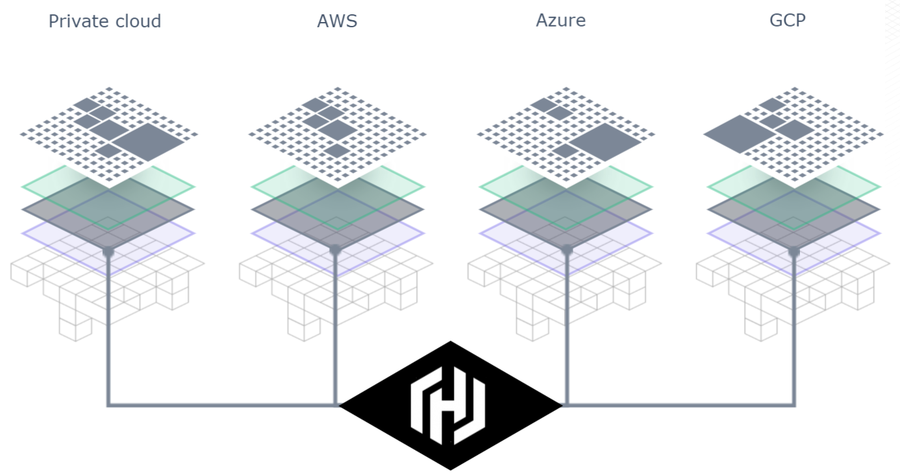

???

---
name: jit
class: center, middle
# Just in time access in a zero trust world

???

---
name: jit
class: center, middle
# Our Focus Today:
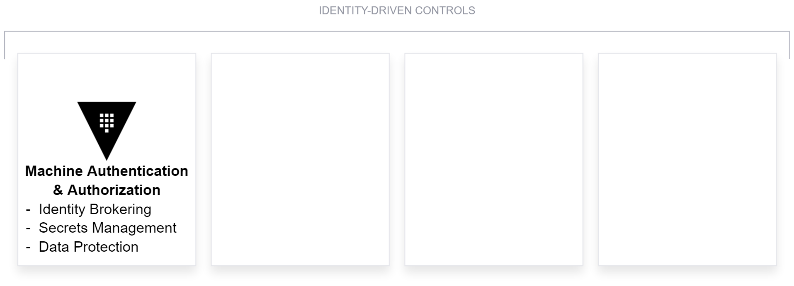

???

---
# Applied Zero Trust
Adopting a Zero Trust model requires technical capabilities that...
* Never Trust, Always Verify: Every user or machine must authenticate and be explicitly authorized for access to credentials, APIs, VMs, databases, etc. 
* Principle of Least Privilege: Every user or machine accesses only the resources it requires for a defined purpose and time period.
* Assumed Breach: Continuously defend and encrypt critical PII and company data assuming that your network has been breached.

---
class: title, shelf, no-footer, fullbleed
background-image: url(images/HashiCorp-Title-bkg.jpeg)

# Chapter 1:
## Vault Basics

???

---
# Problems with the Traditional Security Model
- IP Address based rules
- Hardcoded credentials with problems such as:
  - Shared service accounts for apps and users 
  - Difficult to rotate, decommission, and determine who has access
  - Revoking compromised credentials can break entire application stacks

---
class: center, middle
# Identity Based Security
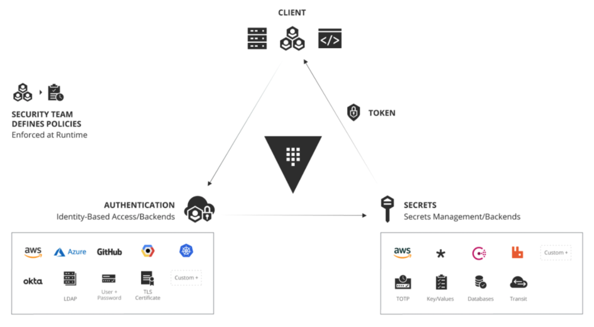
**[Identity Based Security and Low Trust Networks](https://www.hashicorp.com/identity-based-security-and-low-trust-networks)**

???

---
# Identity Based Security
Vault was designed to address the security needs of modern applications. It differs from the traditional approach by using...
* Identity based rules allowing security to stretch across perimeter
  * Never Trust, Always Verify
* Dynamic, short-lived, credentials that are frequently rotated and unique to every client (no shared credentials)
  * Principle of least privilege
  * Ties all actions back to identity
* Credentials and Entities can be easily invalidated to reduce blast radius

---
class: middle, center
# Vault Architecture - High Availability
Integrated Raft Storage
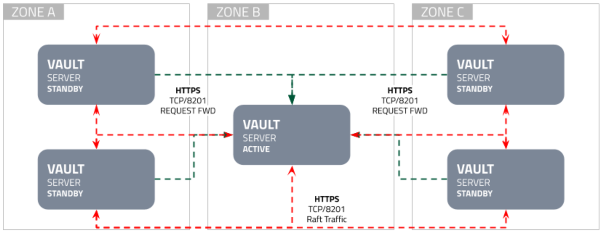

---
class: middle, center
# Vault Architecture - Multi-Region
Replication
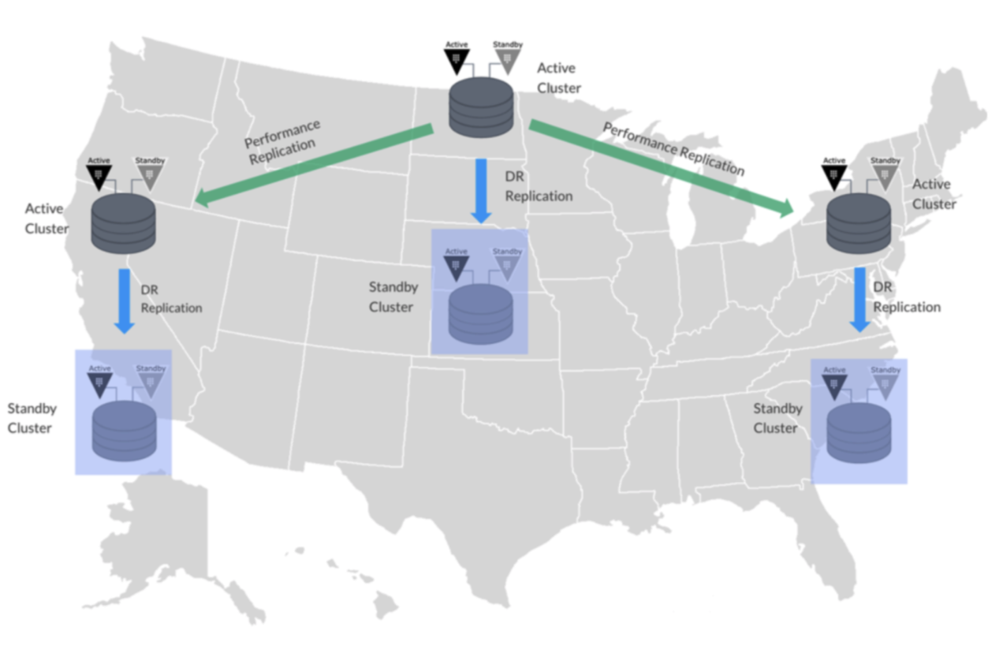

---
# Chapter 1 Review
## What is HashiCorp Vault?
* Vault is a Secrets Management System.
* It is APi-drive and cloud agnostic.
* It can be used in untrusted networks.
* It can authenticate users and applications against many identity systems.
* It supports just-in-time generation of short-lived secrets.
* It runs in highly available clusters that can be replicated across regions.

---
class: title, shelf, no-footer, fullbleed
background-image: url(images/HashiCorp-Title-bkg.jpeg)

# Chapter 2:
## Basic Operations

---
# Interacting with Vault
Vault provides several mechanisms for interacting with it:
* The Vault CLI
* The Vault GUI
* The Vault API

---
# Basic Vault CLI Commands
* **`vault`** by itself will give you a list of many Vault CLI Commands
  * The list starts with the most common ones
* **`vault version`** tells you the version of Vault you are running
* **`vault read`** is used to read secrets from Vault
* **`vault write`** is used to write secrets to Vault  
The **`-h`**, **`-help`**, **`--help`** flags can be added to get help for any Vault CLI command

---
# Running a Production Vault Server
Running a Vault server in “Prod” mode involves multiple steps
* Specify a configuration in a config file
* Start the server
* Initialize the server to get unseal keys and an initial root token
* Unseal the Vault server with the unseal keys

---
# Initializing Vault Clusters
* Recall that a Vault cluster runs multiple Vault servers
* Each Vault cluster must be initalized once
* This is done with the **`vault operator init`** command
* The number of key shares and the key threshold can be specified with the **`key-shares`** and **`key-threshold`** CLI options
* The command returns the unseal keys and initial root token for the cluster

---
class: title, shelf, no-footer, fullbleed
background-image: url(images/HashiCorp-Title-bkg.jpeg)

# Chapter 3:
## Vault Auth Methods and Static Secrets

---
class: middle, center
# Vault Authentication Methods
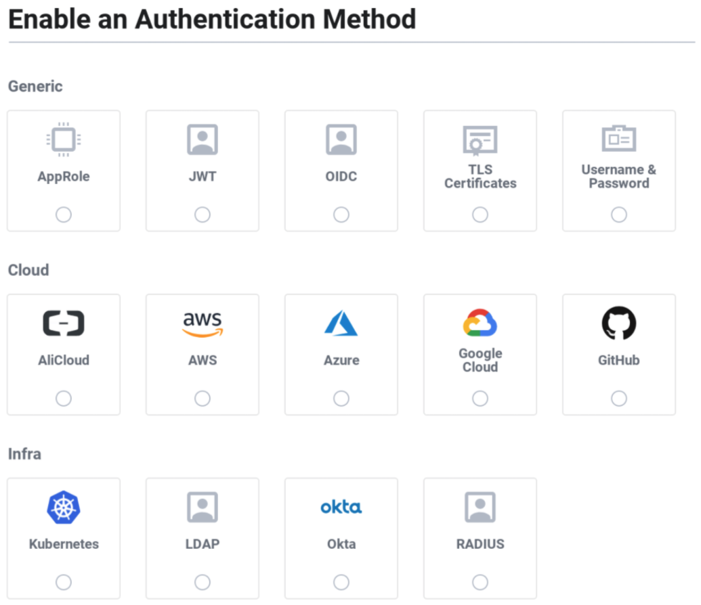
Vault acts as an Identity Broker for the underlying platform or cloud.  
Use the right tool for the job to authenticate your clients!

---
class: middle, center
# Vault Secrets Engines
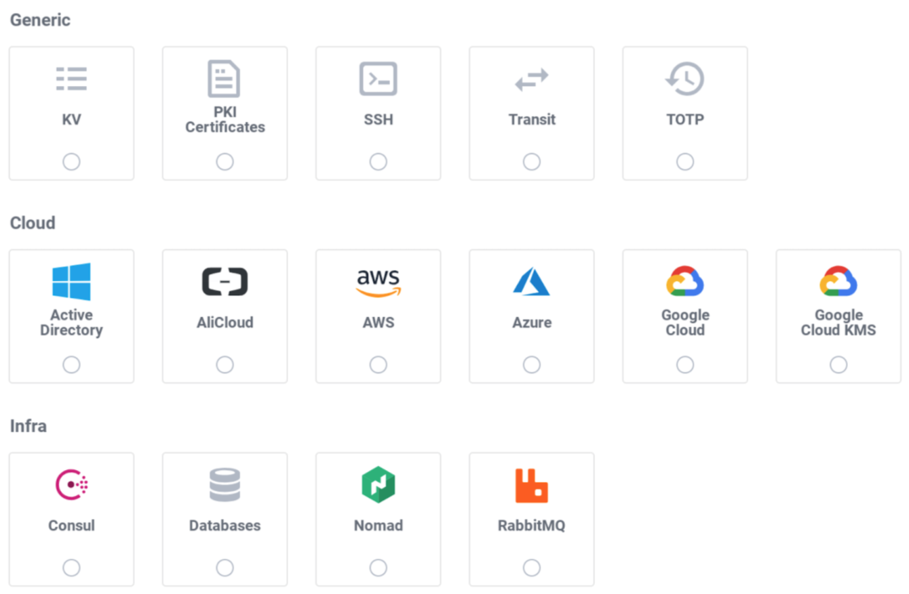
Vault includes many different Secrets Engines

---
# KV Secrets Engine Commands
* Use this command to mount an instance of the KV v2 secrets engine on the default path `kv`: 
`vault secrets enable -version=2 kv`
* The `vault kv` commands allow you to interact with KV engines
  * `vault kv list` lists secrets at a specified path
  * `vault kv put` writes a secret at a specified path
  * `vault kv get` reads a secret at a specified path
  * `vault kv delete` deletes a secret at a specified path
* Other `vault kv` subcommands operate on versions of KV v2 secrets

---
class: title, shelf, no-footer, fullbleed
background-image: url(images/HashiCorp-Title-bkg.jpeg)

# Lab 1:
## Vault Basics

---
# Doing Labs with Instruqt
* Instruqt is the platform used for HashiCorp's workshops
* Instruqt labs are run in “tracks” that are divided into “challenges”
* If you’ve never used Instruqt before, start with this **[tutorial](https://play.instruqt.com/instruqt/tracks/getting-started-with-instruqt)**
* Otherwise, you can skip to the next slide

---
# Lab 1: Vault Basics
In this lab you will cover some basics of Vault like the CLI, GUI, K/V Secret Engine, and Userpass Auth Method

Lab Link: https://play.instruqt.com/hashicorp/tracks/vault-basics

---
class: title, shelf, no-footer, fullbleed
background-image: url(images/HashiCorp-Title-bkg.jpeg)

# Chapter 4:
## Dynamic Secrets

---
class: title-slide, center
.middle[
  ### Why are Dynamic Secrets so Important?
]

---
class: middle, center
# Static Secret Management - Historical
Administrators obtained static, long-lived credentials and manually configured applications
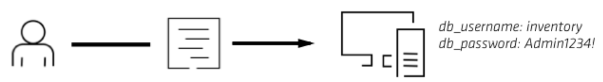

---
class: middle, center
# Static Secret Management - Scaling
You shouldn’t share AD credentials with your teammates, so why do so with machines and services?
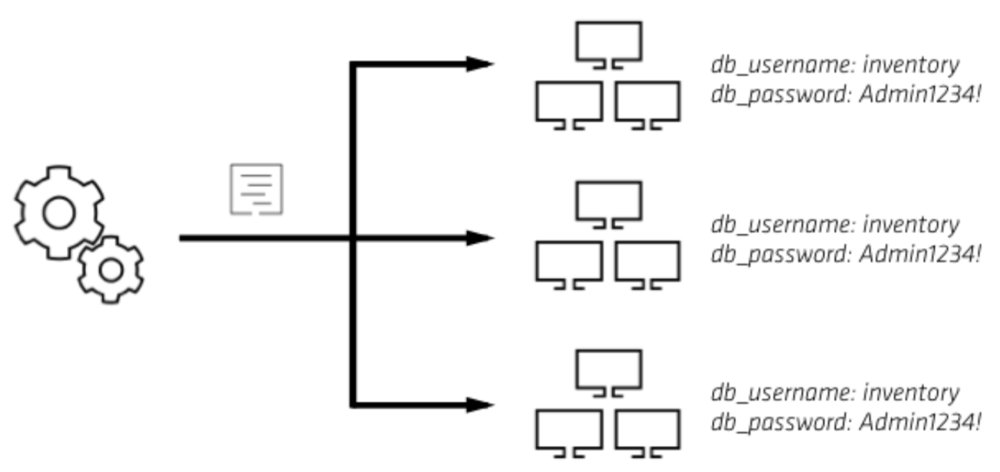

---
class: middle, center
# Dynamic Secrets in Action
Unique, short-lived, just-in-time credentials for each application instance
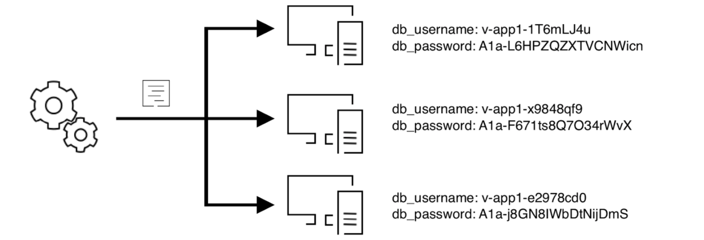

---
# Dynamic Secrets: Protecting Databases
* Database credentials are historically long-lived
* Vault’s Database Secrets Engine dynamically generates short-lived credentials for databases
* It supports configuration of database connections and roles with different permissions and time-to-live (TTL) settings
* Users or applications request credentials for a specific role from Vault
* Vault manages the lifecycle of these credentials, automatically deleting them from the database when the TTl expires
* Auditing is now improved as each application instance has a unique credential

---
class: col-2
# Dynamic Secrets Engine: Plugins

* Cassandra
* Elasticsearch
* Influxdb
* HanaDB
* MongoDB
* MSSQL
* MySQL/MariaDB
* PostgresQL
* Oracle
* Snowflake
* And more (New plugins are always being added!)

---
# Dynamic Secrets Engine: Workflow
1. Enable an instance of the database secrets engine
1. Configure it with the correct Plugin and connection URL, using a service account created for Vault
1. Create one or more roles with TTLS and SQL statements that specific required permissions. (Principle of least privilege)
1. Applications and users can request credentials from Vault that are valid for the default TTL of the role, but can be renewed up to the max TTL
1. Vault automatically deletes expired credentials from the database
1. If credentials are compromised, administrators can revoke them immediately. (Break glass)

---
class: middle, center
# Dynamic Secrets Engine: Workflow
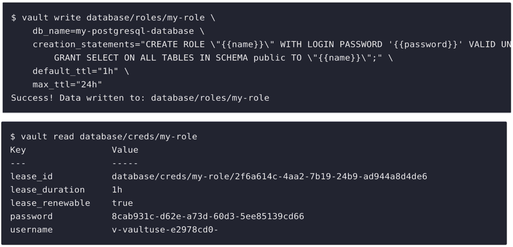

---
# Other Dynamic Secret Engines
* Public Key Infrastructure / Venafi
* SSH Keys
* AWS/Azure/GCP/AliCloud API credentials
* Active Directory / LDAP service accounts (Dynamic, check-in-check-out)
* Consul Tokens
* TFE Tokens

---
class: title, shelf, no-footer, fullbleed
background-image: url(images/HashiCorp-Title-bkg.jpeg)

# Lab 2:
## Dynamic MySQL credentials

---
# Lab Environment
In this lab we’ll use a MySQL database server that runs on the Vault Server

Lab Link: https://play.instruqt.com/hashicorp/tracks/vault-dynamic-database-credentials

---
# Configuration Steps for MySQL
1. Enable the database secrets engine on some path in Vault
1. Configure it with the MySQL plugin, connection URL, username, password, and allowed roles
1. Rotate the “root credentials”: Vault modifies the password given in step 2 so that no humans know it anymore
1. Create roles that can create new credentials that are valid for a specific period of time

---
class: title, shelf, no-footer, fullbleed
background-image: url(images/HashiCorp-Title-bkg.jpeg)

# Chapter 5:
## Encryption as a Service

---
# Applied Zero Trust
* Assume Breach: Continuously defend critical PII data and company data with the assumption that your network has been breached
  * The average time to determine adversarial presence within an enterprise is 191 days (Ponemon Institute)
* What are our customers trying to achieve?
  * Encryption of all critical data
  * Universal KMS support for applications in hybrid cloud environments
  * Consolidated workflows for hardware (KMIP) encryption solutions
  * Fips 140-2 (140-3) Compliance

---
# Data Breaches: The application layer
* With cloud adoption, the traditional approach to securing customer data breaks down
* Adversary’s are not typically breaking into a cloud datacenter and stealing physical hardware
* They are breaking into organizations via phishing attacks, exposed networks, and supply chain attacks
* Once inside the network they are escalating credentials and gaining privileged access to databases and systems

---
class: col-2
# Compromised DBA Creds
Breaches are commonly carried out via attackers who have gained escalated credentials. They were then able to bypass TDE as an example. CC numbers are exposed in plaintext
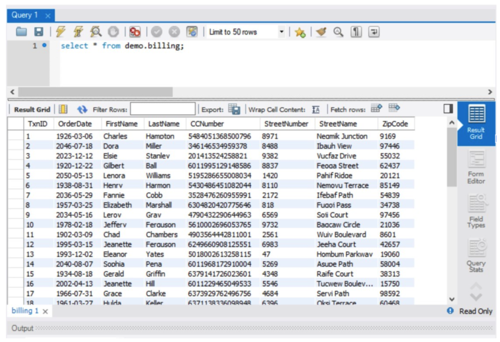

---
# Solution: Transform Secret Engine
1. Vault’s Transform And Transit Secret Engines function as an Encryption-as-a-Service
1. Developers use Vault to encrypt and decrypt data outside of Vault
.center[]

---
# Transform (& Transit) Engine Benefits:
* Vault’s Transform Engine provides developers with a well-architected API so they do not have to become encryption or cryptography experts
* Vault is platform agnostic so developers can code against one API
* It ensures approved ciphers and algorithms are used
* It supported automated key rotation and re-wrapping
* If an attacker manages to get access to the encrypted data, they will only see ciphertext that is useless without Vault.
* The Transform Secret engine is Format Preserving. Thus, it does not require any changes to database structure
  * i.e. 16 digits CCNs are encrypted as 16 digit ciphertext

---
# Transform Data Masking
.center[]

---
# Transit Secret Engine
.center[]

---
# Example with Encryption Enabled
.center[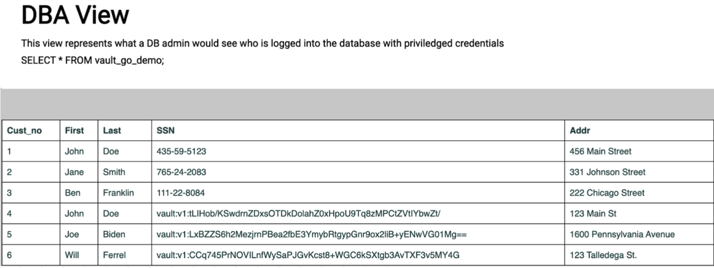]

---
class: col-2
# Tokenization
.smaller[
* Non-Reversible Identification: Protect data pursuant to requirements for data irreversibility (PCI-DSS, GDPR, etc.) with strong forward secrecy
* Integrated Metadata: Supports metadata for identifying data type and purpose
]
.center[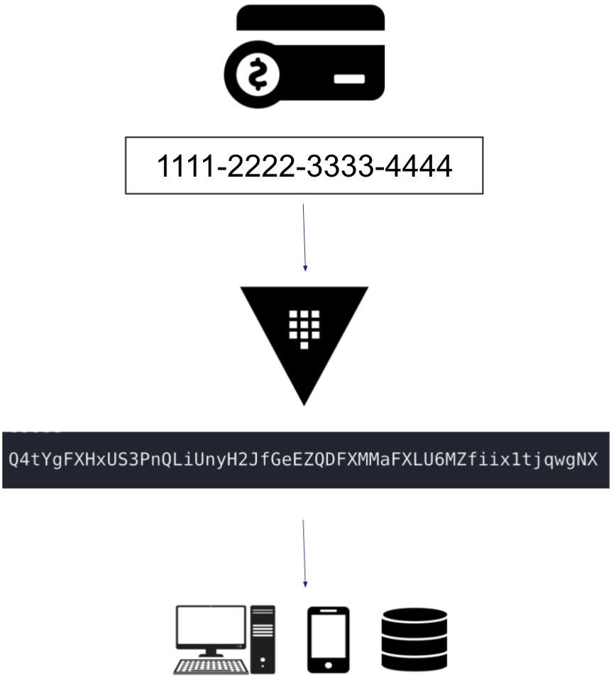]

---
# Tokenization (Diagram)
.center[]

---
# Transform vs. Transit vs. Tokenization
.center[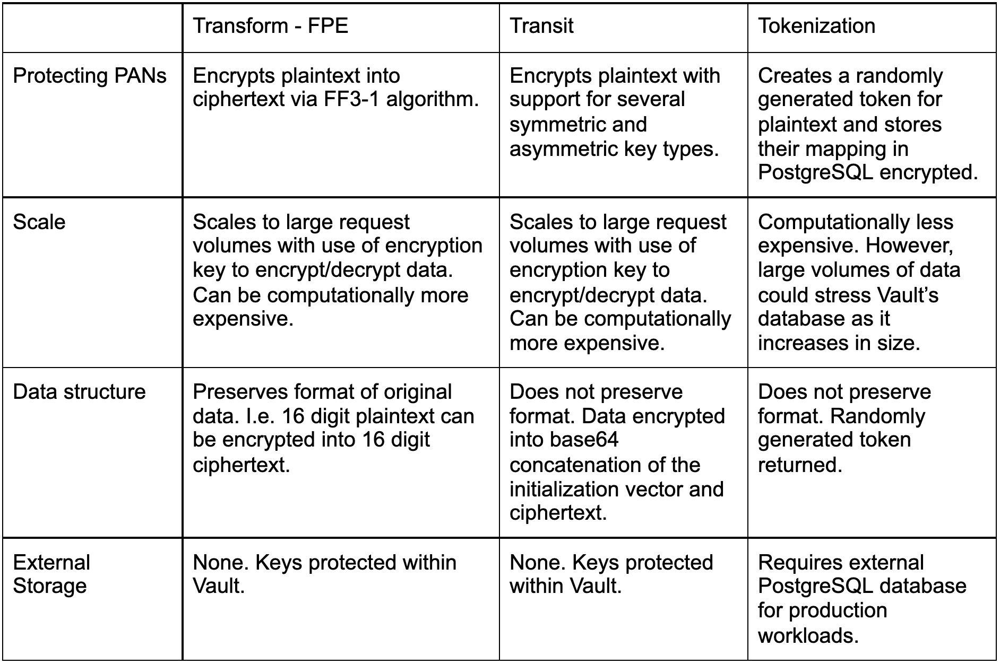]

---
class: title, shelf, no-footer, fullbleed
background-image: url(images/HashiCorp-Title-bkg.jpeg)

# Lab 3:
## Vault Transform & Transit Secret Engines

---
# Lab Environment
In this next Lab we’ll use a web application that leverages both the Transform & Transit Secret engines to encrypt and decrypt data
* The “HashiCups” application will leverage Vault’s API to encrypt customer CCN’s before writing them to the backend database
* This lab will also showcase data-masking as well

Lab Link: https://play.instruqt.com/hashicorp/tracks/adp-vault

---
# Lab Environment Part 2 (Optional)
In this optional lab, you can leverage a Golang application and the Transform Secret Engine to tokenize data.
* The Golang application will leverage Vault’s API to tokenize customer SSN’s before writing them to the backend database
* This lab will also showcase application code modifications as well

Lab Link: https://play.instruqt.com/hashicorp/tracks/vault-advanced-data-protection-with-tokenization

---
class: title, shelf, no-footer, fullbleed
background-image: url(images/HashiCorp-Title-bkg.jpeg

# Chapter 6:
## The Vault KMIP Secret Engine

---
# Data Breach: Filesystem / OS layer
* In this next scenario, an adversary has gained remote access to the underlying database host via SSH/RDP
* They may not have Database credentials; however, they have the ability to inspect files on the host
.center[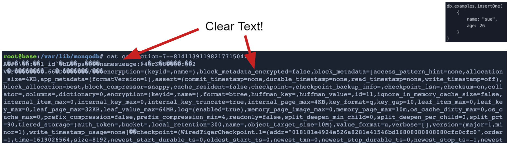]

---
# Data Breach: Filesystem / OS layer
* To provide a defense-in-depth approach, Vault can also act as a KMIP (Key-Management-Interoperability-Protocol) Server
* This enables Vault to act as a KMS server for several different hardware and OS level native encryption technologies
* Some Applications include:
  * Key creation, storage, management
  * Encrypt/decrypt
  * Cryptographic offloads for FDE, volume encryption, secret management, etc

---
# Data Breach: Filesystem / OS layer
* To provide a defense-in-depth approach, Vault can also act as a KMIP (Key-Management-Interoperability-Protocol) Server
* This enables Vault to act as a KMS server for several different hardware and OS level native encryption technologies
* Some Applications include:
  * Key creation, storage, management
  * Encrypt/decrypt
  * Cryptographic offloads for FDE, volume encryption, secret management, etc

---
# Example (MongoDB):
.center[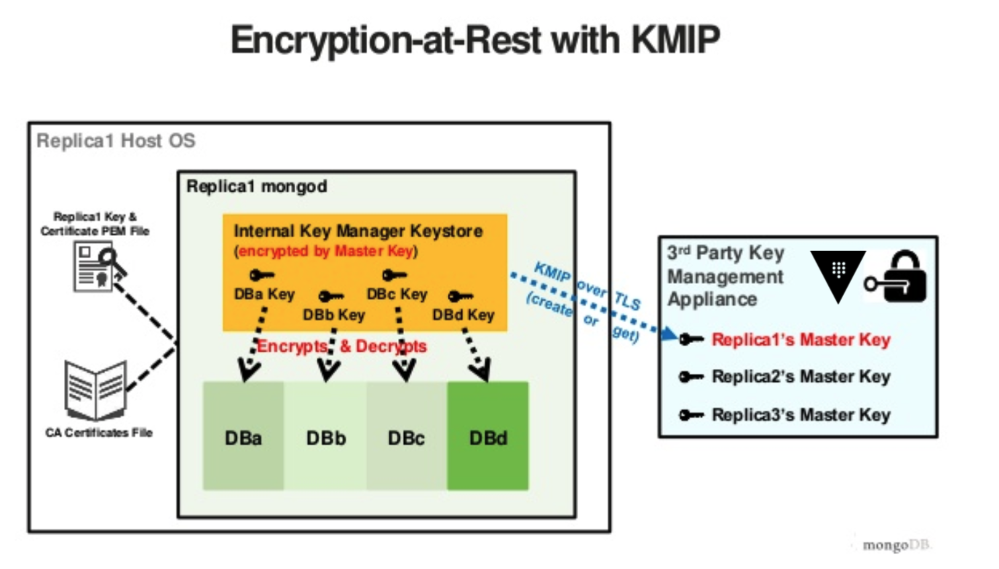]

---
# Examples:
Transparent Database Encryption (TDE): Automatically protect data in MySQL MongoDB, and other databases using Vault Enterprise
* MySQL
* MongoDB Enterprise

---
# Examples:
Disk and Volume Protection: Protect volume data on physical (FDE) and virtual (VMDK) infrastructures on prem and in the cloud
* NetApp Storage Encryption, NetApp Full Disk Encryption
* Dell EMC Unity, Data Domain, Vmwax, etc.
* HPE Key Manager, Tape Storage

---
# Examples:
Portable Key Management: Protect encryption keys for data including files, virtual machines, and more across on-prem and cloud infrastructures
* IBM Filenet
* Oracle Key Vault
* **VMWare Vsphere**
* Cisco UCS
* Rubrik
* Brocade Encryption SAN

---
class: col-2
# Key Management Secrets Engine
.smaller[* The Key Management secrets engine provides a consistent workflow for distribution and lifecycle management of cryptographic keys in various key management service (KMS) providers

* It allows organizations to maintain centralized control of their keys in Vault while still taking advantage of cryptographic capabilities native to the KMS providers]
.center[]

---
class: title, shelf, no-footer, fullbleed
background-image: url(images/HashiCorp-Title-bkg.jpeg)
# Lab 4:
## The Vault KMIP Secret Engine (MongoDB Encryption)

---
# Lab Environment
In this next Lab we’ll leverage Vault to act as a KMIP key management server for MongoDB’s data encryption
* First we will look at how the data collections would look to an adversary that gains access to the host
* We will then show how to protect against this threat vector with Vault’s KMIP integration

Lab Link: https://play.instruqt.com/hashicorp/tracks/vault-kmip-secrets-engine-mongodb

---
class: title, shelf, no-footer, fullbleed
background-image: url(images/HashiCorp-Title-bkg.jpeg)

# Chapter 7:
## Consul Service Mesh

---
class: col-2, title, no-footer
background-image: url(images/Consul_Wallpaper_Background-2.jpg)
Service Networking Across Any Cloud

Automate network configurations, discover services, and enable secure connectivity across any cloud or runtime
Automate network configurations, discover services, and enable secure connectivity across any cloud or runtime.

.center[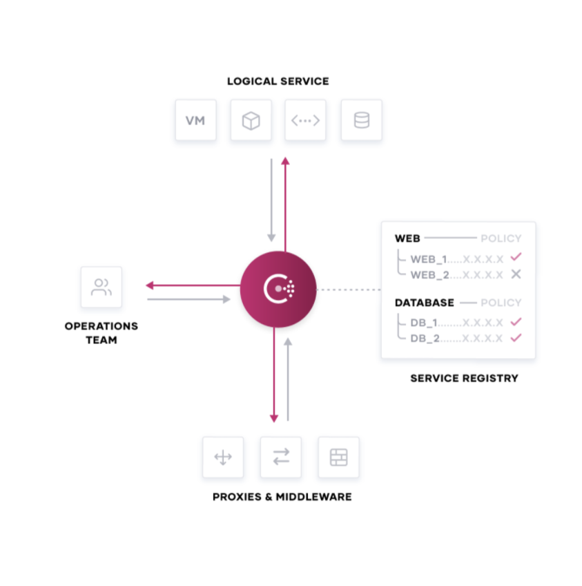]

---
class: col-2
# Establish the connection  - 1/2
.smaller[* The proxy of the web service uses Consul service discovery APIs to request the location of the DB
* The local agent returns the proxy’s IP address/Port of a healthy DB instance
* The local agent also returns the URI for the expected identity of the service it is connected to
* Proxies between web and database start TLS handshake to authenticate the identity]

.center[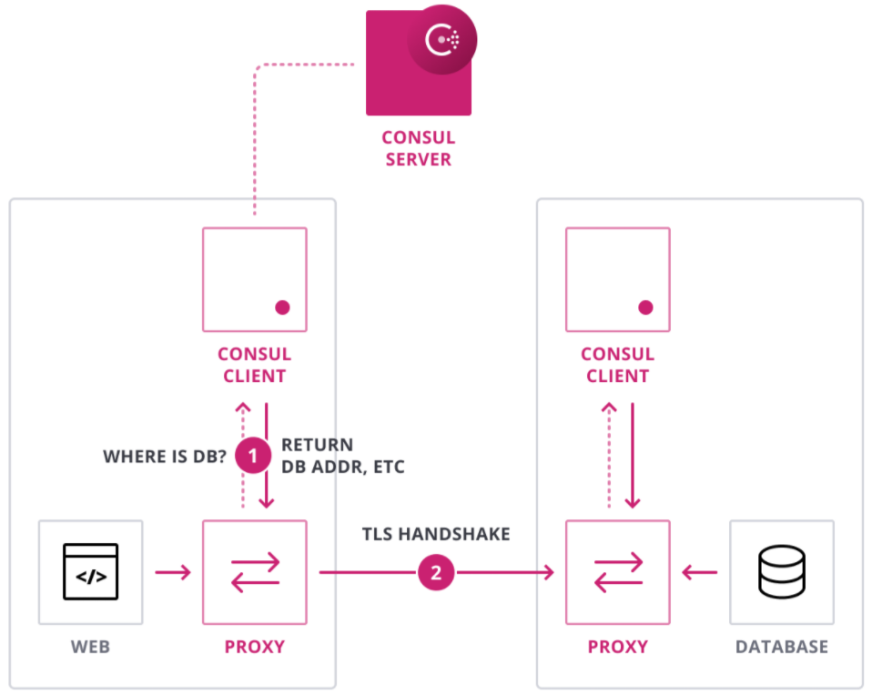]

---
class: col-2
# Establish the connection  - 1/2
.smaller[* The DB proxy sends the authorization request to its local agent 

* The local agent authorizes the connection based on locally cached intention

* Mutual TLS is established]

.center[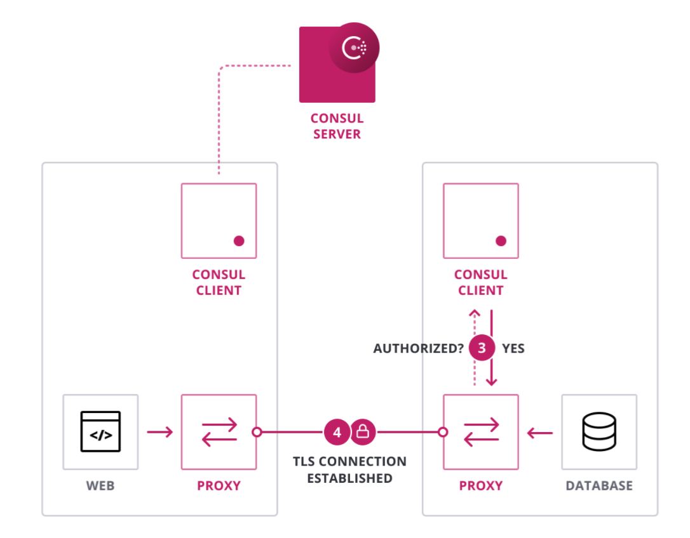]

---
class: title, shelf, no-footer, fullbleed
background-image: url(images/HashiCorp-Title-bkg.jpeg)

# Chapter 7:
## Boundary

---
# Traditional workflow for access
.center[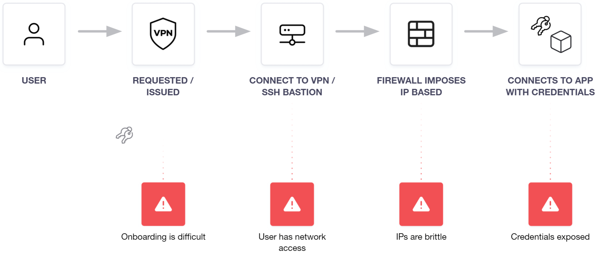]

---
# HashiCorp Boundary
Ephemeral Access Vision
.center[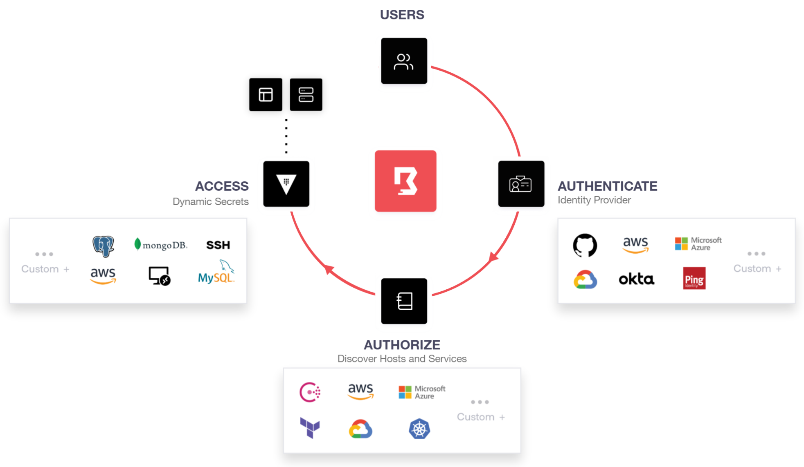]

---
# Access Model
.center[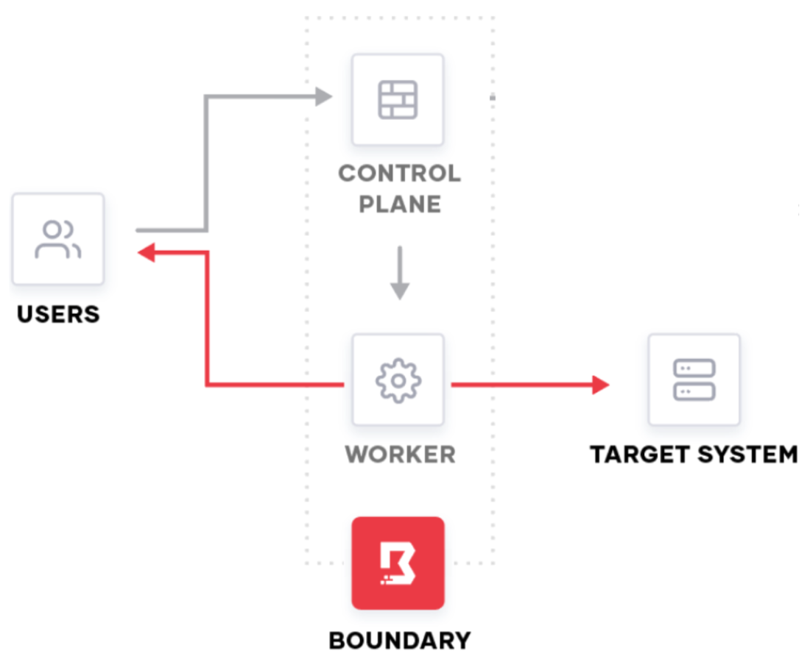]

---
# Just-in-time Credentials (Roadmap)
.center[]

---
class: title, shelf, no-footer, fullbleed
background-image: url(images/HashiCorp-Title-bkg.jpeg)

# Epilogue

---
# Workshop Feedback Survey
Your feedback is important to us!

The survey is short, we promise: **[HashiCorp Workshop Survey](https://docs.google.com/forms/d/1jlyG6dj6zAtvhDorELtyuX7eQwPsKGOpmsXqTQb3aXo/edit)**
