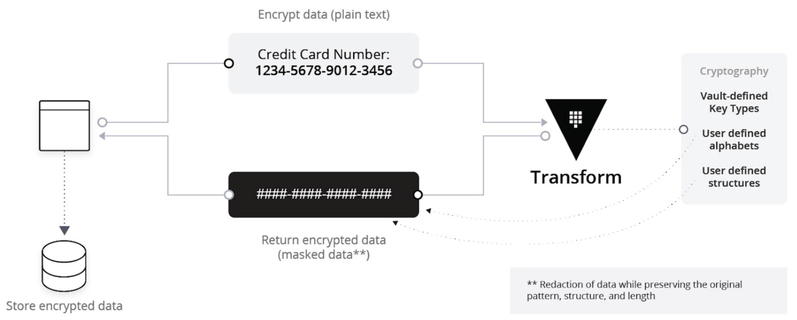
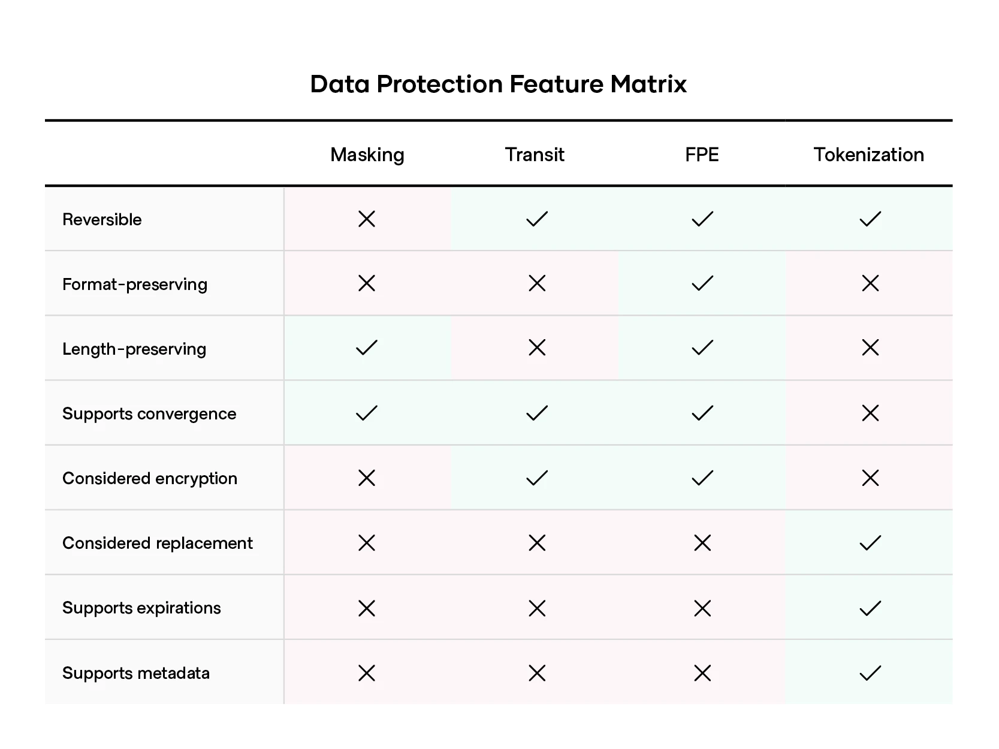
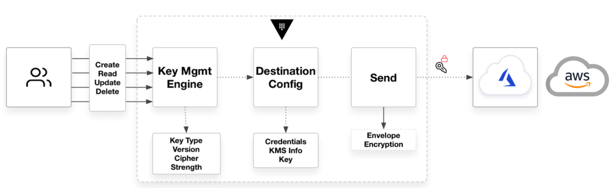

name: field-workshops-assets-index
class: title, shelf, no-footer, fullbleed
background-image: url(images/HashiCorp-Title-bkg.jpeg)

  

    
  

  

    
  

  

    
  

# Zero Trust Security & Data Protection
## Trust Nothing. Authenticate and Authorize Everything.

???

This workshop introduces students to Vault and some of its more advanced data
protection capabilities to enable the Zero Trust security model.

We will also touch on Consul and Boundary, and where they fit into the Zero Trust model

---
layout: true

.footer[
- Copyright © 2022 HashiCorp
- 
]

---
name: Link-to-Slide-Deck
# The Slide Deck
  
### Follow along on your own computer at this link:

https://hashicorp.github.io/field-workshops-vault/slides/multi-cloud/adp

???

The link to this slide deck

---
name: intros
# Introductions

* Your Name
* Job Title
* Secrets Management Experience

???

* Use this slide to introduce yourself, give a little bit of your background story, then go around the room and have all your participants introduce themselves.

---
name: prerequisites
# Prerequisites

- Some very basic familiarity with the following Vault concepts
  - Interacting with Vault via one of the CLI, GUI, or API
      - The Vault binary
      - Client-Server model
  - Vault Authentication Methods (High-level understanding)
  - Vault Secrets Engines (High-level understanding)

???

* This workshop assumes some basic familiarity with Vault, but we will explain
everything as we go so don't worry too much

---
name: table of contents
# Table of Contents
* HashiCorp Vault Overview
* Dynamic Database Secrets
* API Encryption as a Service (& Tokenization)
* Filesystem/Database/Hardware Encryption as a Service

???

* We're going to be covering the following topics...

---
name: environment
# Lab Environment Used
* This workshop uses Instruqt for hand-on labs.
* Instruqt labs are run in “tracks” that are divided into “challenges”
* This workshop uses the following tracks
  1. Vault Basics
  1. Vault Dynamic Database Credentials
  1. Vault Transform and Transit Secrets Engines (App-Level Encryption)
  1. (Optional) Vault Transform-Tokenization Secrets Engine
  1. (Optional) Vault Key Management Secrets Engine
  1. Vault KMIP Secrets Engine (Filesystem/Database Level Encryption)
* Your instructor will provide the URLs for the tracks.

???

* We'll have some hands-on exercises to go through
* Ask if everyone has the Instruqt invite links, and send out new invites if
needed

---
name: prologue
class: title, shelf, no-footer, fullbleed
background-image: url(images/HashiCorp-Title-bkg.jpeg)

# Prologue
## HashiCorp and Zero Trust

???

---
name: securing
class: shelf, no-footer
## Securing a datacenter was easy...

* All unauthorized traffic or access could be restricted/blocked
* Networks were trusted and apps and databases could interconnect with ease
* Four walls and trusted network protected secrets and sensitive information
* Resources were mostly static. Rules were based upon IP addresses, credentials were baked into source code or kept in a static file on disk

##### But what happens when your apps and infrastructure extend to multiple datacenters, cloud, or both?

???

* Traditional security models were built on the idea of perimter based security
* (go through each point on the slide)

---
name: securing
class: col-2
# Secure Infrastructure

With each new cloud, network topologies become more complex
#### Your infrastructure is now one IAM API call away from exposure

???

* Moving to the multi-cloud or hybrid environments means that fixed perimeter no
longer exists
* Networks are more complicated, and with access configured via APIs, it doesn't
take much to accidentally grant access to the wrong people

---
name: jit
class: center, middle
# Just in Time Access in a Zero Trust World

???

* Rather than relying on fixed attributes like IP addresses, we need some form
of Identity-based access, where we verify something's identity before letting it
access things
* Four parts to that (go over those on slide)

---
name: jit
class: center, middle
# Our Focus Today

???

* We are mostly going to be focusing on that first problem today, how we can
identify machines, and grant access to secrets and other means of data protection

---
# Applied Zero Trust
Adopting a Zero Trust model requires technical capabilities that...
* Never Trust, Always Verify: Every user or machine must authenticate and be explicitly authorized for access to credentials, APIs, VMs, databases, etc.
* Principle of Least Privilege: Every user or machine accesses only the resources it requires for a defined purpose and time period.
* Assumed Breach: Continuously defend and encrypt critical PII and company data assuming that your network has been breached.

???

* We'll be discussing that in the context of of Zero Trust
* (go over points on slide)

---
class: title, shelf, no-footer, fullbleed
background-image: url(images/HashiCorp-Title-bkg.jpeg)

# Chapter 1:
## Vault Basics

???

Chapter 1 introduces Vault

---
# Problems with the Traditional Security Model
- IP Address based rules
- Hardcoded credentials with problems such as:
  - Shared service accounts for apps and users
  - Difficult to rotate, decommission, and determine who has access
  - Revoking compromised credentials can break entire application stacks

???

* Earlier we discussed the traditional perimeter-based security model. Here are
some problems with it:
* (go over each of these points)

---
class: center, middle
# Identity Based Security

**[Identity Based Security and Low Trust Networks](https://www.hashicorp.com/identity-based-security-and-low-trust-networks)**

???
* Here we see that Vault has multiple means of authenticating users and applications with its Auth Methods.
* Vault can manage many types of secrets and excels at generating short-lived, dynmamic secrets.
* Vault's ACL policies are associated with tokens that users and applications use to access secrets after authenticating.
* Tokens can only read/write secrets that its policies allow.
* Click on the link to read a white paper about identity-based security in low trust networks.

---
# Identity Based Security
Vault was designed to address the security needs of modern applications. It differs from the traditional approach by using...
* Identity based rules allowing security to stretch across perimeter
  * Never Trust, Always Verify
* Dynamic, short-lived, credentials that are frequently rotated and unique to every client (no shared credentials)
  * Principle of least privilege
  * Ties all actions back to identity
* Credentials and Entities can be easily invalidated to reduce blast radius

???
* This slide discusses how Vault is designed for modern applications.
* Mapping that onto the principles of zero trust... (go over each point)

---
class: middle, center
# Vault Architecture - High Availability
Integrated Raft Storage

???
* Vault allows multiple servers to be combined in a highly available cluster within a single cloud region or physical data center.
* In this way, if a availability zone goes down, you still have a quorum of Vault servers available to handle requests

---
class: middle, center
# Vault Architecture - Multi-Region
Replication

???
* Vault Enterprise supports replication between clusters across regions and data centers.
* It supports Disaster Recovery and Performance replication.
* These can be used together.

---
# Chapter 1 Review
## What is HashiCorp Vault?
* Vault is a Secrets Management System.
* It is API-driven and cloud agnostic.
* It can be used in untrusted networks.
* It can authenticate users and applications against many identity systems.
* It supports just-in-time generation of short-lived secrets.
* It runs in highly available clusters that can be replicated across regions.

???

* To review... (go through points on slide)

---
class: title, shelf, no-footer, fullbleed
background-image: url(images/HashiCorp-Title-bkg.jpeg)

# Chapter 2:
## Basic Operations

???
Chapter 2 focuses on interacting with Vault

---
# Interacting with Vault
Vault provides several mechanisms for interacting with it:
* The Vault [CLI](https://www.vaultproject.io/docs/commands/index.html)
* The Vault [GUI](https://learn.hashicorp.com/vault/getting-started/ui)
* The Vault [API](https://www.vaultproject.io/api-docs/index/)

---
# Basic Vault CLI Commands
* **`vault`** by itself will give you a list of many Vault CLI Commands
  * The list starts with the most common ones
* **`vault version`** tells you the version of Vault you are running
* **`vault read`** is used to read secrets from Vault
* **`vault write`** is used to write secrets to Vault  
The **`-h`**, **`-help`**, **`--help`** flags can be added to get help for any Vault CLI command

???

* We're going to be using the CLI in our hands-on portions, so some useful
commands to know:
* (go through each of these)

---
# Running a Production Vault Server
Running a Vault server in “Prod” mode involves multiple steps
* Specify a configuration in a config file
* Start the server
* Initialize the server to get unseal keys and an initial root token
* Unseal the Vault server with the unseal keys

???

* You can run a local Vault in Dev mode, for quick testing
* To run a Vault server in production mode
  * You define all your configuration in config files
  * You run the command `vault server`
  * A brand new Vault with nothing inside it needs to be initialized, that is we
  tell it to create a new master encryption key, some unseal key shards that can
  be combined to derive that encryption key, and a root token with full admin
  access to do the initial setup
  * Vault starts in what we call a sealed state, which just means that it does
  not know the encryption key, so we need to provide some of those unseal key
  shards

---
# Initializing Vault Clusters
* Recall that a Vault cluster runs multiple Vault servers
* Each Vault cluster must be initalized once
* This is done with the **`vault operator init`** command
* The number of key shares and the key threshold can be specified with the **`key-shares`** and **`key-threshold`** CLI options
* The command returns the unseal keys and initial root token for the cluster

???

* A cluster of Vault servers has many Vault servers
* We only need to initialize the cluster itself once
* You run the `vault operator init` command against one of the servers
* This has some parameters you can specify to define how many key shares you
want to generate, and how many of them need to be combined to derive the
encryption key. The idea is you would give one of these to various people, so
you need several people to come together to unseal Vault.
* Once you run this command, it'll give you that initial root token, as well as
all the unseal key shards. This is obviously not ideal, as then one person knows
all of these, so you also have options when intializing to specify PGP keys to
encrypt these with. In this way, you guarantee that only one person can access
each unseal key share.

---
class: title, shelf, no-footer, fullbleed
background-image: url(images/HashiCorp-Title-bkg.jpeg)

# Chapter 3:
## Vault Auth Methods and Static Secrets

???

Chapter 3 focuses on Vault authentication methods and secrets

---
class: middle, center
# Vault Authentication Methods

Vault acts as an Identity Broker for the underlying platform or cloud. 
Use the right tool for the job to authenticate your clients!

???
* Auth methods are how your users and apps and users verify their identity.
* In the same way you might present some kind of valid ID at the hotel check-in desk, users and apps provide some kind of credential or token to authenticate.
* You can enable multiple auth methods and multiple instances of the same auth method.

---
class: middle, center
# Vault Secrets Engines

Vault includes many different Secrets Engines

???
* Use this screenshot from the Vault UI to talk about Vault's many secrets engines but note that the next slide lists them too.
* Some are for storing static secrets.
* Others can dynamically generate secrets such as database and cloud credentials.
* There is even one called "Transit" that provides encryption as a service.

---
# KV Secrets Engine Commands
* Use this command to mount an instance of the KV v2 secrets engine on the default path `kv`: 
`vault secrets enable -version=2 kv`
* The `vault kv` commands allow you to interact with KV engines
  * `vault kv list` lists secrets at a specified path
  * `vault kv put` writes a secret at a specified path
  * `vault kv get` reads a secret at a specified path
  * `vault kv delete` deletes a secret at a specified path
* Other `vault kv` subcommands operate on versions of KV v2 secrets

???

* Describe how to mount an instance of the KV v2 secrets engine.
* Describe the various `vault kv` subcommands.

---
class: title, shelf, no-footer, fullbleed
background-image: url(images/HashiCorp-Title-bkg.jpeg)

# Lab 1:
## Vault Basics

???
These slides introduce the Vault Basics track.

---
# Doing Labs with Instruqt
* Instruqt is the platform used for HashiCorp's workshops
* Instruqt labs are run in “tracks” that are divided into “challenges”
* If you’ve never used Instruqt before, start with this **[tutorial](https://play.instruqt.com/instruqt/tracks/getting-started-with-instruqt)**
* Otherwise, you can skip to the next slide

???
* We'll be using the Instruqt platform for labs in this workshop.
* Don't worry if you've never used it before: there is an easy tutorial that you can run through in 5-10 minutes.

---
# Lab 1: Vault Basics
In this lab you will cover some basics of Vault like the CLI, GUI, K/V Secrets Engine, and Userpass Auth Method

Lab: **Vault Basics**

Your instructor will provide the URL for the track.

???
* Now, you can try running some Vault CLI commands yourself in the first challenge of our first Instruqt track in this workshop.

---
class: title, shelf, no-footer, fullbleed
background-image: url(images/HashiCorp-Title-bkg.jpeg)

# Chapter 4:
## Dynamic Secrets

???

* This chapter introduces Vault's Database secrets engine which can dynamically generate short-lived credentials for various databases.

---
class: title-slide, center
.middle[
  ### Why are Dynamic Secrets so Important?
]

---
class: middle, center
# Static Secret Management - Historical
Administrators obtained static, long-lived credentials and manually configured applications

???

* Traditionally, credentials needed by applications were static
* An admin user, for example a DBA, would create a new user on the database then
hand that password over to the application developer
* The dev would then configure their application with these static credentials

---
class: middle, center
# Static Secret Management - Scaling
You shouldn’t share AD credentials with your teammates, so why do so with machines and services?

???

* If you have 100 different machines, then using the static method means your
DBA now needs to generate 100 different users and passwords, and your dev needs
to configure each application instance individually
* Practically, that wouldn't happen, because it's time consuming so all these
application instances would use a shared password
* Let's think about some of the challenges with that
 * What happens if we need to rotate this password? Well now we've got 100 apps
 we need to update with the new password
 * So we don't rotate them very often, because it's effort to update everywhere
 * If you're lucky, this is a planned rotation. If you're unlucky, this password
 could have been compromised in a breach

---
class: middle, center
# Dynamic Secrets in Action
Unique, short-lived, just-in-time credentials for each application instance

???

* With dynamic secrets, you can have one secret per application, which is
short-lived
* So if an individual instance is breached, the other 99 are unaffected
* And any credentials which are compromised are only valid for a short period of
time

---
# Dynamic Secrets: Protecting Databases
* Database credentials are historically long-lived
* Vault’s Database Secrets Engine dynamically generates short-lived credentials for databases
* It supports configuration of database connections and roles with different permissions and time-to-live (TTL) settings
* Users or applications request credentials for a specific role from Vault
* Vault manages the lifecycle of these credentials, automatically deleting them from the database when the TTL expires
* Auditing is now improved as each application instance has a unique credential

???
* As an example, Vault's Database secrets engine supports dynamic generation of short-lived credentials (usernames and passwords) for databases.
* This avoids storing long-lived or permanent credentials on app servers that can easily be compromised.
* Short-lived credentials are much more secure since ex-employees and others are very unlikely to know the current values.

---
class: col-2
# Dynamic Secrets Engine: Plugins

* Cassandra
* Elasticsearch
* Influxdb
* HanaDB
* MongoDB
* MSSQL
* MySQL/MariaDB
* PostgresQL
* Oracle
* Snowflake
* And more (New plugins are always being added!)

???
* The database secrets engine has out-of-the-box plugins for many databases.
* Custom plugins can also be built.

---
# Dynamic Secrets Engine: Workflow
1. Enable an instance of the database secrets engine
1. Configure it with the correct Plugin and connection URL, using a service account created for Vault
1. Create one or more roles with TTLs and SQL statements that specific required permissions. (Principle of least privilege)
1. Applications and users can request credentials from Vault that are valid for the default TTL of the role, but can be renewed up to the max TTL
1. Vault automatically deletes expired credentials from the database
1. If credentials are compromised, administrators can revoke them immediately. (Break glass)

???
* This slide lays out the basic workflow used for all of the Datbase secrets engine plugins.
* All of the plugins work the same basic way.
* A service account with permissions to manage users on the database server is required by each connection.
* User creation and revocation SQL statements are specified for roles to determine the permissions og generated users within various databases.
* Multiple connections and roles can be created for a single secrets engine instance to support connecting to multiple database servers with different levels of access.
* The TTL settings can be tuned to suit your needs.

---
class: middle, center
# Dynamic Secrets Engine: Workflow

???

* To make use of this, you define a role in Vault, which determines how new
database users or roles are created. This example has a MySQL statement
* When reading from Vault, Vault will run that command on the database, then
return the credentials to the user, along with a lease which defines how long
those credentials are valid for

---
# Other Dynamic Secrets Engines
* Public Key Infrastructure / Venafi
* SSH Keys
* AWS/Azure/GCP/AliCloud API credentials
* Active Directory / LDAP service accounts (Dynamic, check-in/check-out)
* Consul Tokens
* TFE Tokens

???

* Vault can also generate other types of dynamic secrets
* (go through examples)

---
class: title, shelf, no-footer, fullbleed
background-image: url(images/HashiCorp-Title-bkg.jpeg)

# Lab 2:
## Dynamic MySQL credentials

---
# Lab Environment
In this lab we’ll use a MySQL database server that runs on the Vault Server

Lab: **Vault Dynamic Database Credentials**

Your instructor will provide the URL for the track.

???
* Discuss the lab environment.

---
# Configuration Steps for MySQL
1. Enable the database secrets engine on some path in Vault
1. Configure it with the MySQL plugin, connection URL, username, password, and allowed roles
1. Rotate the “root credentials”: Vault modifies the password given in step 2 so that no humans know it anymore
1. Create roles that can create new credentials that are valid for a specific period of time

???
* These are the basic steps for configuring the mysql plugin with Vault's database secrets engine.
* The username and password set on the config path must already exist and have permission to manage users.

---
class: title, shelf, no-footer, fullbleed
background-image: url(images/HashiCorp-Title-bkg.jpeg)

# Chapter 5:
## Encryption as a Service

???

* This chapter introduces Vault's Transit and Transform secrets engines which function as Vault's Encryption-as-a-Service (EaaS).

---
# Applied Zero Trust
* Assume Breach: Continuously defend critical PII data and company data with the assumption that your network has been breached
  * The average time to determine adversarial presence within an enterprise is 191 days (Ponemon Institute)
* What are our customers trying to achieve?
  * Encryption of all critical data
  * Universal KMS support for applications in hybrid cloud environments
  * Consolidated workflows for hardware (KMIP) encryption solutions
  * Fips 140-2 (140-3) Compliance

???

* Thinking back to what we're trying to acheive here with Zero Trust
 * We want to assume that we've already been breached
 * And therefore, we need to make sure critical data is protected
 * Ponemon Institute estimates an average of 191 days before a breach is even
 detected
* So organizations want to ensure all critical data is encrypted, Key Management
Systems are available everywhere in a hybrid cloud, hardware encryption is
available, and compliance is ensured where needed

---
# Data Breaches: The Application Layer
* With cloud adoption, the traditional approach to securing customer data breaks down
* Adversaries are not typically breaking into a cloud datacenter and stealing physical hardware
* They are breaking into organizations via phishing attacks, exposed networks, and supply chain attacks
* Once inside the network they are escalating credentials and gaining privileged access to databases and systems

???

* With a traditional on-prem datacenter, you'd be worried about securing your
perimeter and preventing people from stealing the physical hardware
* These days, that's not what's going on. Threat models have changed, and we're
dealing with phishing attacks, exposed networks, supply chain attacks, and other
ways of breaking into a network.
* Once inside, they find ways of pivoting from their initial vulnerability and
figuring out ways to elevate permissions, maybe gaining access to privilidged
databases and other systems.

---
class: col-2
# Compromised DBA Creds
Breaches are commonly carried out via attackers who have gained escalated credentials. They were then able to bypass TDE as an example. Credit card numbers are exposed in plaintext

???

* Once the attackers are in, they can bypass things like Transparent Data
Encryption, and now all these credit card numbers are available in plaintext
* Let's go shopping!

---
# Vault's Solutions
1. Vault’s Transform And Transit Secrets Engines provide Encryption-as-a-Service
2. Developers use Vault to encrypt and decrypt data outside of Vault

???

* So we want to be assuming that people are already snooping around in our DBs
* With Vault's Encryption as a Service capabilities, applications can encrypt
data before it's stored outside of Vault

---
# Solution 1:Transit Secrets Engine
.center[]

???
* There are two means of doing this, the first of which is the Transit secrets engine.
* It provides an encryption API & service that are secure, accessible and easy to implement.
* Instead of forcing developers to learn cryptography, we present them with a familiar API that can be used to encrypt and decrypt data that is stored outside of Vault.

---
# Example with Encryption Enabled
.center[]

???

* If an attacker manages to get access to the encrypted data, they will only see ciphertext that is useless without Vault.

---
# Solution 2: Transform Secrets Engine
.center[]

???

* The transform allows for more advanced encryption methods, for example
Format Preserving Encryption.
* In this example, we pass in a credit card number, and we get back something
which still looks like a credit card number. That can then be stored in a DB
or external system without any change to the schema

---
# Transform Data Masking
.center[]

???

* For cases where some people need access to some of the data, but not all of it
masking is available. As an example, this helps in cases where you need to show
somebody the last 4 digits of a credit card number

---
# Transform (& Transit) Engine Benefits:
* Vault’s Transform Engine provides developers with a well-architected API so they do not have to become encryption or cryptography experts
* Vault is platform agnostic so developers can code against one API
* It ensures approved ciphers and algorithms are used
* It supported automated key rotation and re-wrapping
* If an attacker manages to get access to the encrypted data, they will only see ciphertext that is useless without Vault.
* The Transform Secrets engine is Format Preserving. Thus, it does not require any changes to database structure
  * i.e. 16 digits CCNs are encrypted as 16 digit ciphertext

???

* Vault's Transit and Transform Engines provides developers a well-architected EaaS API so that they don't have to become encryption or cryptography experts.
* It provides centralized key management, with standard APIs
* It ensures that only approved ciphers and algorithms are used.
* It supports automated key rotation and re-wrapping.
* And with both, any attackers in your DB will only see cyphertext

---
class: col-2
# Tokenization
.smaller[
* Non-Reversible Identification: Protect data pursuant to requirements for data irreversibility (PCI-DSS, GDPR, etc.) with strong forward secrecy
* Integrated Metadata: Supports metadata for identifying data type and purpose
]
.center[]

???

* There are other use-cases where it's not important to be able to decrypt the
database, but you still need to be able to store sensitive data
* This is where the Tokenization comes in
* This allows you to store sensitive data in a way that is not directly
reversible. As in, it's not cyphertext that can be decrypted, and it's not
a hash that can be brute forced.
* Tokenized data has metadata that can be queried so you can identify what it is
and what it's for without needing to view the original sensitive data

---
# Tokenization (Diagram)
.center[]

???

* As an example:
 * We send a credit card number to Vault, it is stored securely within Vault
 and a token is returned in reference to it
 * This token is then what you store in the database

---
# Transform vs. Transit vs. Tokenization
.center[]

???

* Which of these methods you use depends on your use-case
* (go through features)

---
class: title, shelf, no-footer, fullbleed
background-image: url(images/HashiCorp-Title-bkg.jpeg)

# Lab 3:
## Vault Transform & Transit Secrets Engines

---
# Lab Environment
In this next Lab we’ll use a web application that leverages both the Transform and Transit Secrets engines to encrypt and decrypt data
* The “HashiCups” application will leverage Vault’s API to encrypt customer credit card numbers before writing them to the backend database
* This lab will also showcase data-masking

Lab: **Advanced Data Protection with Transform**

Your instructor will provide the URL for the track.

???
* Discuss the web app we will be using in this chapter's lab.
* Indicate that we will first run without Vault and then with it.

---
# Lab 3 Part 2 (Optional)
In this optional lab, you can leverage a Golang application and the Transform Secrets Engine to tokenize data.
* The Golang application will leverage Vault’s API to tokenize customer Social Security numbers before writing them to the backend database
* This lab will also showcase application code modifications as well

Lab: **Vault ADP with Tokenization**

Your instructor will provide the URL for the track.

---
class: title, shelf, no-footer, fullbleed
background-image: url(images/HashiCorp-Title-bkg.jpeg

# Chapter 6:
## The Vault KMIP Secrets Engine

---
# Data Breach: Filesystem/OS layer
* In this next scenario, an adversary has gained remote access to the underlying database host via SSH/RDP
* They may not have Database credentials; however, they have the ability to inspect files on the host
.center[]

---
# Data Breach: Filesystem/OS layer
* To provide a defense-in-depth approach, Vault can also act as a KMIP (Key-Management-Interoperability-Protocol) Server
* This enables Vault to act as a KMS server for several different hardware and OS level native encryption technologies
* Some Applications include:
  * Key creation, storage, management
  * Encrypt/decrypt
  * Cryptographic offloads for FDE, volume encryption, secret management, etc

---
# Data Breach: Filesystem/OS layer
* To provide a defense-in-depth approach, Vault can also act as a KMIP (Key-Management-Interoperability-Protocol) Server
* This enables Vault to act as a KMS server for several different hardware and OS level native encryption technologies
* Some Applications include:
  * Key creation, storage, management
  * Encrypt/decrypt
  * Cryptographic offloads for FDE, volume encryption, secrets management, etc

---
# Example (MongoDB):
.center[]

---
# Examples:
Transparent Database Encryption (TDE): Automatically protect data in MySQL MongoDB, and other databases using Vault Enterprise
* MySQL
* MongoDB Enterprise

---
# Examples:
Disk and Volume Protection: Protect volume data on physical (FDE) and virtual (VMDK) infrastructures on prem and in the cloud
* NetApp Storage Encryption, NetApp Full Disk Encryption
* Dell EMC Unity, Data Domain, VMAX, etc.
* HPE Key Manager, Tape Storage

---
# Examples:
Portable Key Management: Protect encryption keys for data including files, virtual machines, and more across on-prem and cloud infrastructures
* IBM Filenet
* Oracle Key Vault
* **VMWare vSphere**
* Cisco UCS
* Rubrik
* Brocade Encryption SAN

---
# Key Management Secrets Engine
This engine provides a consistent workflow for distribution and lifecycle management of cryptographic keys in Key Management Service providers
* Maintain control of keys while taking advantage of cryptographic capabilities native to the KMS providers.
* Manage key lifecycle operations, such as creating, reading, updating, and rotating keys.
* Multi-Cloud organizations can consolidate key management to one central tool.
* Own an original copy of the key material for additional durability.

---
# Example KMS workflow (Azure & AWS GA)
Optional Lab: **Vault Key Management Secrets Engine**
.center[]

Your instructor will provide the URL for the track.

---
class: title, shelf, no-footer, fullbleed
background-image: url(images/HashiCorp-Title-bkg.jpeg)
# Lab 4:
## The Vault KMIP Secrets Engine (MongoDB Encryption)

---
# Lab Environment
In this next Lab we’ll leverage Vault to act as a KMIP key management server for MongoDB’s data encryption
* First we will look at how the data collections would look to an adversary that gains access to the host
* We will then show how to protect against this threat vector with Vault’s KMIP integration

Lab: **Vault KMIP Secrets Engine for MongoDB Encryption**

Your instructor will provide the URL for the track.

---
class: title, shelf, no-footer, fullbleed
background-image: url(images/HashiCorp-Title-bkg.jpeg)

# Chapter 7:
## Consul Service Mesh

---
class: col-2, title, no-footer
background-image: url(images/Consul_Wallpaper_Background-2.jpg)
Service Networking Across Any Cloud

Automate network configurations, discover services, and enable secure connectivity across any cloud or runtime
Automate network configurations, discover services, and enable secure connectivity across any cloud or runtime.

.center[]

---
class: col-2
# Establish the connection  - 1/2
.smaller[* The proxy of the web service uses Consul service discovery APIs to request the location of the DB
* The local agent returns the proxy’s IP address/Port of a healthy DB instance
* The local agent also returns the URI for the expected identity of the service it is connected to
* Proxies between web and database start TLS handshake to authenticate the identity]

.center[]

---
class: col-2
# Establish the connection  - 1/2
.smaller[* The DB proxy sends the authorization request to its local agent

* The local agent authorizes the connection based on locally cached intention

* Mutual TLS is established]

.center[]

---
class: title, shelf, no-footer, fullbleed
background-image: url(images/HashiCorp-Title-bkg.jpeg)

# Chapter 8:
## Boundary

---
# Traditional workflow for access
.center[]

---
# HashiCorp Boundary
Ephemeral Access Vision
.center[]

---
# Access Model
.center[]

---
# Just-in-Time Credentials (Roadmap)
.center[]

---
class: title, shelf, no-footer, fullbleed
background-image: url(images/HashiCorp-Title-bkg.jpeg)

# Epilogue

---
# Workshop Feedback Survey
Your feedback is important to us!

The survey is short, we promise: **[HashiCorp Workshop Survey](https://docs.google.com/forms/d/1jlyG6dj6zAtvhDorELtyuX7eQwPsKGOpmsXqTQb3aXo/edit)**
