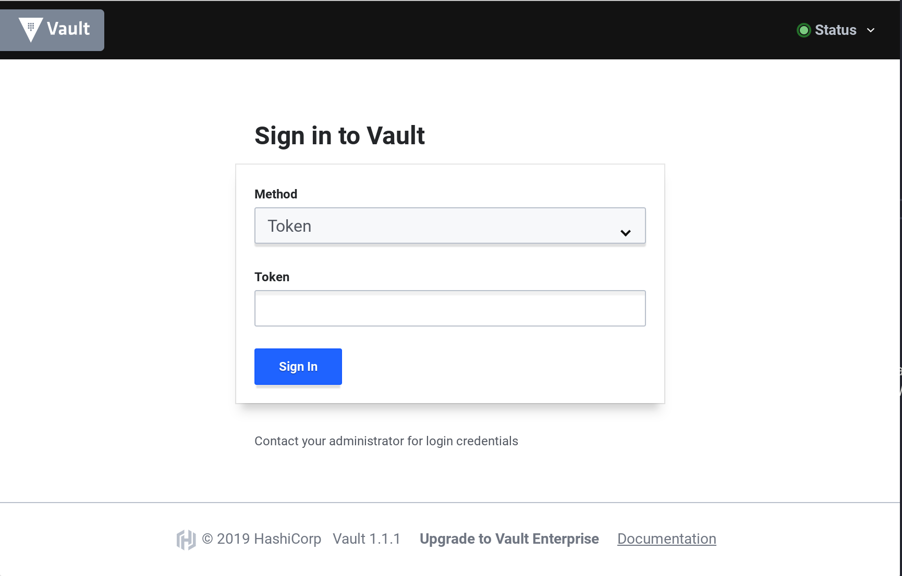
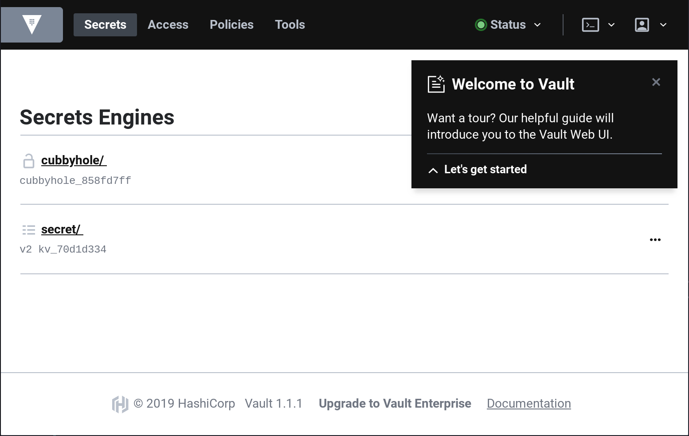

name: Chapter-2
class: title, shelf, no-footer, fullbleed
background-image: url(https://hashicorp.github.io/field-workshops-assets/assets/bkgs/HashiCorp-Title-bkg.jpeg)
count: false


# Chapter 2      
## Interacting With Vault


???
Chapter 2 focuses on interacting with Vault

---
layout: true

.footer[
- Copyright © 2021 HashiCorp
- 
]

---
name: Interacting-With-Vault
# Interacting With Vault

Vault provides several mechanisms for interacting with it:
* The Vault [CLI](https://www.vaultproject.io/docs/commands/index.html)
* The Vault [UI](https://learn.hashicorp.com/vault/getting-started/ui)
* The Vault [API](https://www.vaultproject.io/api-docs/index/)

???

* Chapter 2 focuses on interacting with Vault

---
name: Vault-CLI
# The Vault CLI
* The Vault CLI is a Go application.
* It runs on macOS, Windows, Linux, and other operating systems.
* You can download the latest version [here](https://www.vaultproject.io/downloads/).

???
* The Vault CLI is distributed as a Go binary.
* It runs on multiple operating systems.

---
name: installing-Vault-CLI
# Installing the Vault CLI
* Installing Vault on your laptop is easy:
  * Simply download the zip file.
  * Unpack the `vault` binary.
  * Place the binary in your path.

See this [tutorial](https://learn.hashicorp.com/vault/getting-started/install) for more details.

???
Installing Vault is easy.

---
name: some-cli-commands
# Some Basic Vault CLI Commands
* `vault` by itself will give you a list of many Vault CLI commands.
  * The list starts with the most common ones.
* `vault version` tells you the version of Vault you are running.
* `vault read` is used to read secrets from Vault.
* `vault write` is used to write secrets to Vault.

The `-h`, `-help`, and `--help` flags can be added to get help for any Vault CLI command.

???
Let's discuss some of the basic Vault CLI commands.

---
name: vault-server-modes
# Vault Server Modes
Vault servers can be run in two different modes:
* "Dev" mode that is only intended for development
* "Prod" mode that can be used in QA and production

???
* Discuss Vault's two server modes

---
name: vault-dev-server
# Vault's "Dev" Mode
* It is not secure.
* It stores everything in memory.
* Vault is automatically unsealed.
* The root token can be specified before launching.

**Please never store actual secrets on a server run in "Dev" mode.**

???
* Discuss limitations of Vault's "Dev" mode.
* Warn students to never store real secrets on a Dev server.

---
name: Vault-UI
# The Vault UI
* In order to use the Vault UI, you must sign in.
* Vault supports multiple authentication methods.
* A new Vault server will only have the Token auth method enabled.
* In the challenge you will soon complete, you use the Token auth method and specify "root" as the token.

???

* Let's talk about the Vault UI a bit, including ways of signing into it.
* While you used the token "root" in the last challenge, you'll be running a Vault server in "Prod"  mode in the rest of the track and will have to use the token generated when you initialize that server in the next challenge.
---
name: signing-into-the-vault-ui
# Signing into the Vault UI
.center[]

???
* This slide shows a screenshot of the login dialog for the Vault server.

---
name: welcome-to-vault
# The "Welcome to Vault" Tour
.center[]
* When you first login to Vault, you can take a tour.

???
* Explain the "Welcome to Vault" tour.
* Explain how to get rid of it.
* Point out that they can restart the tour with the "Restart guide" menu under their user icon in the upper right corner of the UI.

---
name: vault-api-1
# The Vault API

* Vault has an HTTP API that you can use to configure Vault and manage your secrets.
* You can check Vault's health with a simple `curl` command followed by `jq` to format the JSON output.

Command:
```bash
curl http://localhost:8200/v1/sys/health | jq
```
???
* Let's talk about the Vault HTTP API

---
name: vault-api-2
# The Vault API

```json
{
  "initialized": true,
  "sealed": false,
  "standby": false,
  "performance_standby": false,
  "replication_performance_mode": "disabled",
  "replication_dr_mode": "disabled",
  "server_time_utc": 1557180149,
  "version": "1.4.3",
  "cluster_name": "vault-cluster-db6f271d",
  "cluster_id": "33e85d7c-63bb-7523-0165-9d1aee722d70"
}
```

???
Here is the output from Vault's sys/health endpoint

---
name: vault-api-3
# Authenticating Against the Vault API

* The sys/health endpoint didn't require any authentication.
* But most Vault API calls do require authentication.
* This is done with a Vault token that is provided with the `X-Vault-Token` header.

???
* Talk about how most Vault HTTP API calls will require authentication with a Vault token.

---
name: chapter-2-review-questions
# 📝 Chapter 2 Review

* How can you interact with Vault?
* What options can you use to get help for Vault commands?
* What are the two Vault server modes?

???
* Let's review what we learned in this chapter.

---
name: chapter-2-review-answers
# 📝 Chapter 2 Review
* How can you interact with Vault?
  * The Vault CLI
  * The Vault UI
  * The Vault API
* What options can you use to get help for Vault commands?
  * `-h`, `-help`, and `--help`
* What are the two Vault server modes?
  * Dev and Prod

???
* Here are the answers to the review questions.
