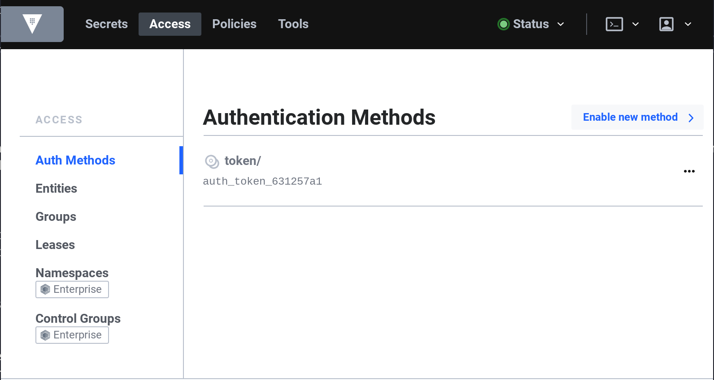

name: chapter-5
class: title, shelf, no-footer, fullbleed
background-image: url(https://hashicorp.github.io/field-workshops-assets/assets/bkgs/HashiCorp-Title-bkg.jpeg)
count: false

# Chapter 5      
## Vault Authentication Methods


???

* Chapter 5 introduces Vault authentication methods
* It focuses on the Userpass method.

---
layout: true

.footer[
- Copyright © 2019 HashiCorp
- 
]

---

name: Vault-Authorization
Vault ACL Policies
-------------------------
<br>
Vault Access Control List (ACL) Policies let you restrict which secrets your users and applications will have access to. Vault follows the practice of least privilege, with a default setting of *deny*.

Vault administrators must explicity grant access to users and applications with policy statements. Policies express a path, and a set of capabilities for that path. Policies are written in HashiCorp Config Language, or HCL.

Example:
```hcl
# Allow tokens to look up their own properties
path "auth/token/lookup-self" {
    capabilities = ["read"]
}
```

???
Take a look at the Policies tab in your Vault UI. You'll see a default policy along with the root policy. The default policy has some very basic permissions for looking up info about one's own token, etc. The root policy is special and generally reserved for first time setup of Vault.

---

name: Vault-Authorization-1
Path and Capabilities
-------------------------
<br>
The path portion of the policy maps to an API path. Capabilities can include one or more of read, update, list, delete, create, and sudo.

Many organizations structure their Vault server by department or line of business (lob). Here's an example policy the administrator created for line of business A, department 1:

```hcl
path "lob_a/dept_1/*" {
    capabilities = ["read", "list", "create", "delete", "update"]
}
```

This policy grants all permissions to all secrets mounted under `lob_a/dept_1/` with the wildcard (*) operator.

???
Sudo is mainly reserved for interacting with 'root-protected' paths like things under /sys.

---
name: chapter-4a-lab
.center[.lab-header[👩‍🔬 Lab Exercise 4a: Create New Policies]]
<br><br>
Policies are assigned when a user or app authenticates. Create the following two policies using the Vault UI Policies tab. You can copy and paste the code below right into the UI.

Call the first policy *lob_a* and the second policy *secret*.

Policy #1: lob_a
```hcl
path "lob_a/workshop/*" {
    capabilities = ["read", "list", "create", "delete", "update"]
}
```

Policy #2: secret
```hcl
path "secret/*" {
    capabilities = ["read", "list", "create"]
}
```

---
name: chapter-4a-lab-answer
.center[.lab-header[👩‍🔬 Lab Exercise 4a: Answer]]
<br><br><br>
1. Click on the **Policies** link on the top navigation bar.
1. In the upper right corner, click on **Create ACL Policy**
1. Enter `lob_a` for the name and copy and paste the lob_a policy into the text area.
1. Click **Create Policy** at the bottom of the page.
1. Repeat for the `secret` policy.

---
name: chapter-4-review
📝 Chapter 4 Review
-------------------------
<br>
.contents[
Vault ACL Policies
* Determines what apps and users can access
* Policies are path-based, map to API endpoints
* Capabilities: list, read, create, update, delete
* Assigned when an entity authenticates
* Root policy is special, not for everyday use
]

---
name: Chapter-5
class: center,middle
.section[
Chapter 5
Authenticating to Vault: Auth Methods
]

---
name: Vault-Authentication
Vault Auth Methods
-------------------------
.center[]
Vault supports many different authentication methods. You can enable multiple auth methods, or multiple instances of the same auth method.

???
Auth methods are how your apps and users verify their identity. In the same way you might present some kind of valid ID at the hotel check-in desk, users and apps provide some kind of credential or token to authenticate.

---
name: Vault-Authentication-0
Vault Auth Method: UserPass
-------------------------
.center[]
The simplest authentication method (besides using a token directly) is the userpass method. As the name implies, these are local user accounts on the Vault server itself.

???
In the real world you'd probably have Vault use your Active Directory, LDAP or other system of record for authentication.

The userpass method of authentication is not recommended for production, but it's fine for development and lab environments.

We're keeping it simple here. Userpass does not require an active directory server or any other external provider to work.

---
name: Vault-Authentication-1
Vault Auth Method: UserPass
-------------------------
.center[]
<br>
Let's enable the userpass authentication method in Vault. Click on the **Access** link in the top menu, then select **Enable New Method**.

---
name: Vault-Authentication-2
Vault Auth Method: UserPass
-------------------------
<br><br>
.center[]
<br>
Select the **Username and Password** box and click **Next** at the bottom of the page.

---
name: Vault-Authentication-3
Vault Auth Method: UserPass
-------------------------
<br><br>
.center[]
<br>
Leave the default path of **userpass** and click on **Enable Method**. The userpass authentication method is now mounted at the `userpass/` API endpoint.

---
name: Vault-Authentication-4
Vault Auth Method: UserPass
-------------------------
Next, let's create a couple of users. These steps need to be done on the command line. Make sure you are SSH'd into the Vault server when you run these commands. Copy and paste the below commands into your terminal:

Commands:
```bash
vault write auth/userpass/users/bob \
    password=foo \
    policies=secret

vault write auth/userpass/users/sally \
    password=foo \
    policies=lob_a
```

Output:
```tex
Success! Data written to: auth/userpass/users/bob
Success! Data written to: auth/userpass/users/sally
```

???
Notice the policy section.  Policies are mapped to authentication endpoints.  Tokens generated from those endpoints have the policies assigned to it.

---
name: chapter-5a-lab
.center[.lab-header[👩‍🔬 Lab Exercise 5a: Bob and Sally]]
<br><br><br>
**Exercise 1:**<br>
Log onto the web UI with Bob's account. Create some secret data under the secret/* path, where the default K/V engine is mounted. Log out of Bob's account.

Now log on using Sally's account. Can you see the secret data Bob entered? Why or why not?

**Exercise 2:**<br>
Log back on with your root token, and create a new policy called "readonly" so Sally can *read* and *list* what's inside of `secret/`.

**Hint:** You'll need to recreate Sally's account with a `vault write` command, adding the policy to her account.

---
name: chapter-5a-lab-answers
.center[.lab-header[👩‍🔬 Lab Exercise 5a: Answers]]
<br>
Bob can read, list and create data under the `secret/*` path because his policy allows him to do so. Vault comes with a key/value engine mounted at `secret/` by default.

When Sally logs on she can't even see the `secret/` path because she does not have list permissions. Here are the policy and command you'll need to run to grant Sally read-only access:

Policy: readonly
```hcl
path "secret/*" {
    capabilities = ["read", "list"]
}
```
Vault Command:
```bash
vault write auth/userpass/users/sally \
    password=foo \
    policies=lob_a,readonly
```

???
It's worth mentioning that you can create policies for paths that do not exist yet. Sally has permission to create secrets under lob_a/workshop/ even though she can't see these paths in the UI (yet).

---
name: chapter-5-review
📝 Chapter 5 Review
-------------------------
<br>
.contents[
Vault Authentication Methods
* Supports over a dozen auth methods
* Policies assigned to a token after auth
* Multiple policies can be assigned to an entity
* Policies prevent unauthorized access
* The default policy in vault is *deny*
]

---
name: Chapter-7
class: center,middle
.section[
Chapter 7    
Dynamic Secrets: Protecting Databases
]

---
name: Database-Engine-0
Dynamic Secrets: Protecting Databases
-------------------------
Let's review our lab diagram:
.center[]
Normally database credentials are long-lived and stored on the app server.

With dynamic credentials, we can make a request to Vault, then Vault will use a special account on the database server to create a brand new username and password. Vault manages the lifecycle and policy of these credentials.

???
The database secrets engine supports common database types including MySQL, MSSQL, Oracle, PostgreSQL, MongoDB, Cassandra and others. All of them work the same basic way:

1. Vault admin enables the database secrets engine
1. The database secrets engine is configued with the correct plugin and connection info. A service account with permissions to manage users on the database server is required.
1. A role is created in Vault that executes a SQL statement to create users with the correct permissions and access. You can also define the TTL or time to live for credentials. Multiple roles can be applied to the same secrets engine, for enabling different levels of access.
1. Applications and users can now authenticate and retrieve new database credentials as needed.
1. These 'disposable' credentials can be valid for an hour, a day, or a month. The TTL settings can be tuned to suit your needs.
1. In Case of Emergency: If you suspect credentials have been compromised you can revoke any or all of the outstanding dynamic credentials immediately.

---
name: Database-Engine-1
Configuration Steps
-------------------------
<br><br>
.contents[
1. Enable the database secrets engine
2. Configure it with the MySQL plugin and connect string
3. Create roles that can create new credentials
]

---
name: Database-Engine-2
Dynamic Secrets: Enable and Create Role
-------------------------
The commands for configuring the database secrets backend are long and somewhat complex. We've provided a bash script that you can run to make sure we don't have any typos. From your SSH terminal on the Vault server run the `database_setup.sh` script:

Command:
```bash
./database_setup.sh
```

Output:
```tex
Success! Enabled the database secrets engine at: lob_a/workshop/database/
Success! Data written to: lob_a/workshop/database/roles/workshop-app-long
Success! Data written to: lob_a/workshop/database/roles/workshop-app
Script complete.
```

---
name: Database-Engine-3
Dynamic Secrets: Database
-------------------------
Let's take a closer look at what happened when we ran that script:
```bash
vault secrets enable -path=lob_a/workshop/database database

vault write lob_a/workshop/database/config/wsmysqldatabase \
    plugin_name=mysql-database-plugin \
    connection_url="{{username}}:{{password}}@tcp(${MYSQL_ENDPOINT})/" \
    allowed_roles="workshop-app","workshop-app-long" \
    username="hashicorp" \
    password="Password123!"

vault write lob_a/workshop/database/roles/workshop-app-long \
    db_name=wsmysqldatabase \
    creation_statements="CREATE USER '{{name}}'@'%' IDENTIFIED BY '{{password}}';GRANT ALL ON my_app.* TO '{{name}}'@'%';" \
    default_ttl="1h" \
    max_ttl="24h"

vault write lob_a/workshop/database/roles/workshop-app \
    db_name=wsmysqldatabase \
    creation_statements="CREATE USER '{{name}}'@'%' IDENTIFIED BY '{{password}}';GRANT ALL ON my_app.* TO '{{name}}'@'%';" \
    default_ttl="5m" \
    max_ttl="1h"
```

???
We specified a number of things:
* The path someone would call: "lob_a/workshop/database"
* The name of the database the role can interact with: wsmysqldatabase
* The creation statement that defines the capabilities of the user that is created
* The default time to live.  One role specified an hour, and the other 5 minutes
* The maximum duration for a generated account; 24 hours and 1 hour respectively

---
name: chapter-7a-lab
.center[.lab-header[👩‍🔬 Lab Exercise 7a: Dynamic Credentials]]
<br><br><br>
Exercise 1:<br>
Use the vault command line tool to retreive database credentials from the `lob_a/workshop/database/creds/workshop-app` endpoint.

Exercise 2:<br>
Use a curl command to retreive database credentials from the `lob_a/workshop/database/creds/workshop-app-long` endpoint.

**Hint:** You can look at your previous commands with the `history` command.

---
name: chapter-7a-lab-answers
.center[.lab-header[👩‍🔬 Lab Exercise 7a: Answers]]
<br><br>
Exercise #1<br>
Authenticated users with read access can run the following command to get new credentials:

```bash
vault read lob_a/workshop/database/creds/workshop-app
```

Exercise #2<br>
Pass a valid token along with your curl command and you can do the same thing through the API:

```bash
curl --header 'X-Vault-Token: root' \
http://localhost:8200/v1/lob_a/workshop/database/creds/workshop-app-long
```

---
name: Database-Engine-4
Dynamic Secrets: verify account
-------------------------
Use your newly created credentials to log onto the MySQL database. We've created a handy helper script to make this easier. The script will fetch new credentials from Vault and then use them to log onto the database server, then run a `show databases;` command and exit.

Command:
```bash
./mysql_login.sh
```

Output:
```tex
  % Total    % Received % Xferd  Average Speed   Time    Time     Time  Current
                                 Dload  Upload   Total   Spent    Left  Speed
100   313  100   313    0     0   4574      0 --:--:-- --:--:-- --:--:--  4602
mysql: [Warning] Using a password on the command line interface can be insecure.
+--------------------+
| Database           |
+--------------------+
| information_schema |
+--------------------+
Script complete.
```

---
name: chapter-7-review
📝 Chapter 7 Review
-------------------------
<br>
.contents[
Dynamic Database Secrets Engine
* Support for commercial and OSS databases
* Better than password rotation
* Bring your own authentication method
* Short lived credentials make you more secure
* Each app instance can have its own creds
]

---
name: Chapter-8
class: center,middle
.section[
Chapter 8  
Encryption as a Service (EaaS)
]

---
name: Vault-Transit-Engine
Vault Transit - Encryption as a Service
-------------------------
.center[]

* Vault has an encryption-as-a-service secrets engine called **transit**.
* The transit engine is API-driven encryption
* Centralized key management
* Ensure only approved ciphers and algorithms are used
* Developers never have to worry about managing keys
* Supports automated key rotation and re-wrapping

???
This is encryption that is secure, accessible and relatively easy to implement. Instead of forcing developers to learn cryptography, we present them with a familiar API that can be used to encrypt, decrypt, or both.

---
name: Vault-Transit-Engine-1
Vault Transit - Example Application
-------------------------
In the next lab we'll set up a demo application that uses Vault transit to encrypt and decrypt data. Our app will store its data in the MySQL database we created earlier.  

From your Vault server SSH session run the following command:

Command:
```bash
./transit_setup.sh
```

The script may take a few minutes to complete while it downloads and configures our application.

---
name: Vault-Transit-Engine-2
Vault Transit - Start the Application
-------------------------
First we'll start up the demo application without Vault enabled. Run the following commands to start your app:

Commands:
```bash
cd ~/transit-app-example/backend/
python3 app.py
```

Output:
```tex
In Main...
 * Serving Flask app "app" (lazy loading)
 * Environment: production
   WARNING: Do not use the development server in a production environment.
   Use a production WSGI server instead.
 * Debug mode: off
2019-05-09 18:35:46,596 -     INFO -  werkzeug -            _log -  * Running on http://0.0.0.0:5000/ (Press CTRL+C to quit)
```

This is a Python Flask application. The app listens on port 5000 for traffic.

---
name: Vault-Transit-Engine-3
Vault Transit - Open the App
-------------------------
Open a browser tab and navigate to the address of your Vault server on port 5000.

.center[<br>
http://IPADDRESS:5000]

???
Replace the 'PREFIX' part with your own settings.

---
name: Vault-Transit-Engine-4
Vault Transit - Application Views
-------------------------
<br><br>
There are two main sections in the application.
1. **Records View**
  * The records view displays records in plain text.
  * This view represents what a logged in user or authenticated application might be able to see.

1. **Database View**
  * This view shows the raw records in the database.
  * It is the equivalent of the following SQL statement:

```sql
SELECT * FROM users
```

---
name: Vault-Transit-Engine-5
Vault Transit - Records View
-------------------------
.center[]

As we would expect an authorized user is able to see some of the sensitive data.

---
name: Vault-Transit-Engine-6
Vault Transit - Add a Record
-------------------------
Click the "Add Record" button and enter some data. Don't use your real social security number here.

.center[]

---
name: Vault-Transit-Engine-7
Vault Transit - View the Record
-------------------------
<br><br><br>
Click on **Records** at the top of the page. Notice your new record at the bottom of the list.

Next click on **Database View**. You should see the exact same data. This means that PII (Personally Identifiable Data) is being stored in plain text in our database records.

How can we improve this? Let's enable Vault Transit and see.

---
name: Vault-Transit-Engine-7
Vault Transit - Enable EaaS
-------------------------
Return to your shell and stop the application with the **CTRL-C** command.

Next you'll need to make one change to your config.ini file. You may use **nano** or **vi** to edit the file. The line you need to edit is highlighted below. Change where it says `Enabled = False` to `Enabled = True`:

Command:
```bash
nano config.ini
```

Line to change:
```bash
...
[VAULT]
*Enabled = True
DynamicDBCreds = False
ProtectRecords=False
...
```

Save and exit the file. `CTRL-x` in Nano, `:wq` in vim.

---
name: Vault-Transit-Engine-8
Vault Transit - Enable EaaS
-------------------------
After you have enabled Vault, start the application back up:

Commands:
```bash
python3 app.py
```

Output:
```tex
...
 server on 0.0.0.0 listening on port 5000
 * Serving Flask app "app" (lazy loading)
 * Environment: production
   WARNING: Do not use the development server in a production environment.
   Use a production WSGI server instead.
 * Debug mode: off
2019-02-14 02:38:16,058 -     INFO -  werkzeug -            _log -  * Running on http://0.0.0.0:5000/ (Press CTRL+C to quit)
```

---
name: chapter-8a-lab
.center[.lab-header[👩‍💻 Lab Exercise 8a: EaaS]]
<br><br>
**Exercise 1:**<br>
Enter some more fake employee data into the application.

Browse to the records view. What do you see?

Now browse to the database view? What's different now?

**Exercise 2:**<br>
Go into the Vault UI and click on **lob_a/workshop/transit** from the **Secrets** page.<br>
Click on **customer-key**, then click on **versions**.<br>
Click on the **Rotate encryption key** button at the bottom.

Now go back to the app and add another record. What do you see in the database view?

???
NOTE: There's a known bug in the UI that causes all the dates to be Jan. 1970. These are correct if you query the API.

---
name: chapter-8a-lab-answers
.center[.lab-header[👩‍🔬 Lab Exercise 8a: Answers]]
<br>
.center[]

**Exercise 1:**<br>
When you enabled Vault each new record entered into the database has it's PII send through Vault *before* being written to the database. This greatly reduces the risk of sensitive data being compromised.

Even if an attacker manages to get access to the database they will only be able to see ciphertext (which is useless without the decryption keys that are safely stored in Vault.)

**Exercise 2:**<br>
Even when we rotate the encryption key, the app is unaware of any changes. Once the key is rotated all new records will be encrypted with the new key. Old records can still be decrypted because Vault is using a keyring. If you feel that somehow one of the old keys was compromised you can force all new encryption or decryption to be done with a newer version of the key. Data can also be re-encrypted using the rewrap function.

---
name: chapter-8-review
📝 Chapter 8 Review
-------------------------
<br>
.contents[
Vault Transit - Encryption as a Service
* API-driven encryption
* Centralized key management
* Ensures only algorithms are used
* Users never touch encryption keys
* Supports automated key rotation
* ...and more
]

---
name: Vault-Workshop-Conclusion
Thank You for Participating!
-------------------------
.center[]

For more information please refer to the following links:

* https://www.vaultproject.io/docs/
* https://www.vaultproject.io/api/
* https://learn.hashicorp.com/vault/

---
name: Feedback-Survey
Workshop Feedback Survey
-------------------------
<br><br>
.center[
Your feedback is important to us!

The survey is short, we promise:

http://bit.ly/hashiworkshopfeedback
-------------------------
]
