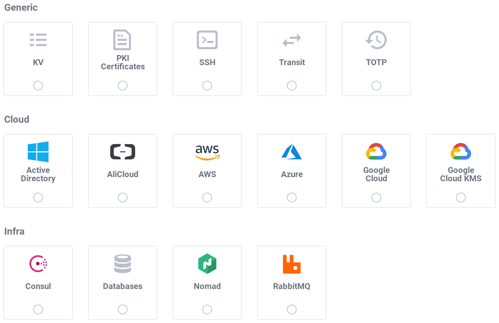

name: chapter-4
class: title, shelf, no-footer, fullbleed
background-image: url(https://hashicorp.github.io/field-workshops-assets/assets/bkgs/HashiCorp-Title-bkg.jpeg)
count: false

# Chapter 4      
## Vault Secrets Engines

???

* Chapter 4 introduces Vault secrets engines
* It focuses on the KV v2 engine.

---
layout: true

.footer[
- Copyright © 2021 HashiCorp
- 
]

---
name: vault-secrets-engines-1
# Vault Secrets Engines

.center[]
.center[Vault includes many different secrets engines.]

???
* Use this screenshot from the Vault UI to talk about Vault's many secrets engines but note that the next slide lists them too.
* Some are for storing static secrets.
* Others can dynamically generate secrets such as database and cloud credentials.
* There is even one called "Transit" that provides encryption as a service.

---
name:vault-secrets-engines-2
# Important Vault Secrets Engines
* Key/Value (KV)
* PKI
* SSH
* TOTP
* Databases
* AWS, Azure, and Google
* Active Directory
* Transit

???
Spend some time pointing out what some of these do:
* KV - Used to manage generic, static secrets. KV v2 supports versioning.
* PKI - Used to generate dynamic X.509 certificates
* SSH - Take all the pain and drudgery out of securing your SSH infrastructure. Vault can provide key signing services that make securing SSH a snap.
* TOTP - The TOTP tool allows Vault to either act as a code-generating device for MFA logins or to provide TOTP server capabilities for MFA infrastructure.
* Databases - Generate dynamic, short-lived database credentials.
* Cloud credentials engines - Generate dynamic, short-lived cloud credentials for major clouds.
* Active Directory - Vault can rotate AD passwords.
* Transit - Implement's Vault's encryption-as-a-service. Provides an API that can handle all your encryption and decryption needs, based on policy, so that you don't have to manage a complicated key infrastructure.

---
name: enabling-secrets-engines
# Enabling Secrets Engines

* Most Vault secrets engines need to be explicitly enabled.
* This is done with the `vault secrets enable` command.
* Each secrets engine has a default path.
* Alternate paths can be specified to enable multiple instances:  `vault secrets enable -path=aws-east aws`
* Custom paths must be specified in CLI commands and API calls: 
`vault write aws-east/config/root` 
instead of 
`vault write aws/config/root`

???

* Talk about enabling secrets engines.
* Talk about default and custom paths
* Explain the examples

---
name: vault-kv-engine
# Vault's KV Secrets Engine
* Vault's KV secrets engine actually has 2 versions:
  * KV v1 (without versioning)
  * KV v2 (with versioning)
* In the second lab challenge, we will use the instance of the KV v2 engine that is automatically enabled for "Dev" mode Vault servers.
* Vault does not enable any instances of the KV secrets engine for "Prod" mode servers.
* So, you'll need to enable it yourself.

???
* We will use Vault's Key/Value (KV) engine in the second challenge of the "Vault Basics" Instruqt track that will be automatically enabled for the "Dev" mode server.
* But we'll need to mount it ourselves for the "Prod" mode server.

---
name: vault-kv-commands
# KV Secrets Engine Commands
* Use this command to mount an instance of the KV v2 secrets engine on the default path `kv`: 
`vault secrets enable -version=2 kv`
* The `vault kv` commands allow you to interact with KV engines.
  * `vault kv list` lists secrets at a specified path.
  * `vault kv put` writes a secret at a specified path.
  * `vault kv get` reads a secret at a specified path.
  * `vault kv delete` deletes a secret at a specified path.
* Other `vault kv` subcommands operate on versions of KV v2 secrets.

???

* Describe how to mount an instance of the KV v2 secrets engine.
* Describe the various `vault kv` subcommands.

---
name: chapter-4-review-questions
# 📝 Chapter 4 Review

* What option is added to the `vault secrets enable` command to enable multiple instances?
* What is the difference between the two versions of the KV secrets engine?
* Can an old version of a KV v2 secret be retrieved?

???
* Let's review what we learned in this chapter.

---
name: chapter-4-review-answers
# 📝 Chapter 4 Review

* What option is added to the `vault secrets enable` command to enable multiple instances?
  * Add the `-path=<path>` option and use `<path>` with the CLI and API.
* What is the difference between the two versions of the KV secrets engine?
  * KV V2 supports versioning of secrets.
* Can an old version of a KV v2 secret be retrieved?
  * Yes. You will do this in Vault UI in the challenge.

???
* Here are the answers to the review questions.
