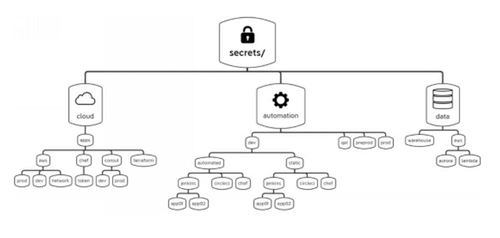

name: chapter-4
class: title, shelf, no-footer, fullbleed
background-image: url(https://hashicorp.github.io/field-workshops-assets/assets/bkgs/HashiCorp-Title-bkg.jpeg)
count: false

# Chapter 4      
## Vault Secrets Engines

???

* Chapter 4 introduces Vault secrets engines
* So far we have covered Vault Overview, Vault
* How to interact with vault
* Running a Production Vault Server

---
layout: true

.footer[
- Copyright © 2021 HashiCorp
- 
]

---
name: vault-secrets-engines-1
# Vault Secrets Engines

.center[]
.center[Vault includes many different secrets engines.]

???
* Secrets engines are components which store, generate, or encrypt data. Secrets engines are incredibly flexible, so it is easiest to think about them in terms of their function. Secrets engines are provided some set of data, they take some action on that data, and they return a result.
* As an example, The AWS secrets engine generates AWS access credentials dynamically based on IAM policies. This generally makes working with AWS IAM easier, since it does not involve clicking in the web UI.
* Or The PKI secrets engine generates dynamic X.509 certificates. With this secrets engine, services can get certificates without going through the usual manual process of generating a private key and Certificate Signing Request.
* Vault Dynamic Database Credentials
Generate dynamic credentials for a MySQL database from Vault.

---
name:vault-secrets-engines-2
# Important Vault Secrets Engines
* Key/Value (KV)
* PKI
* SSH
* TOTP
* Databases
* AWS, Azure, and Google
* Active Directory
* Transit

???
Spend some time pointing out what some of these do:
* KV - Used to manage generic, static secrets. KV v2 supports versioning.
* PKI - Used to generate dynamic X.509 certificates
* SSH -  supports Signed SSH Certificates and One-time SSH Passwords
* Databases - Generate dynamic, short-lived database credentials. In one of our labs later you will generate dynamic credentials for a MySQL database from Vault.
* Cloud credentials engines - Generate dynamic, short-lived cloud credentials for major clouds.
* Active Directory - Passwords are rotated based on preset TTLs and can have a length configured to meet your needs.
* Transit - Implement's Vault's encryption-as-a-service. Provides an API that can handle all your encryption and decryption needs, based on policy, so that you don't have to manage a complicated key infrastructure.

---
name: enabling-secrets-engines
# Enabling Secrets Engines

.center[]

* Most Vault secrets engines need to be explicitly enabled.
* This is done with the `vault secrets enable` command.

???
* As you can see, each secrets engine has a default path.
* As an example of a well-architected K/V structure, shows a segment of a K/V store that was designed with a specific infrastructure team in mind. Remember that every K/V structure can differ depending on the needs of different teams and applications reading secrets from or writing secrets to Vault.

---

name: vault-kv-commands
# KV Secrets Engine Commands
* Use this command to mount an instance of the KV v2 secrets engine on the default path `kv`: 
`vault secrets enable -version=2 kv`
* The `vault kv` commands allow you to interact with KV engines.
  * `vault kv list` lists secrets at a specified path.
  * `vault kv put` writes a secret at a specified path.
  * `vault kv get` reads a secret at a specified path.
  * `vault kv delete` deletes a secret at a specified path.
* Other `vault kv` subcommands operate on versions of KV v2 secrets.

???

* Run the version 2 of KV secrets engine which can retain a configurable number of secret versions. V1 does not allow virsioning.
* Describe the various `vault kv` subcommands.

---
name: chapter-4-review-questions
# 📝 Chapter 4 Review

* What option is added to the `vault secrets enable` command to enable multiple instances?
* What is the difference between the two versions of the KV secrets engine?
* Can an old version of a KV v2 secret be retrieved?

???
* Add the `-path=<path>` option and use `<path>`
* KV V2 supports versioning of secrets.
* 

---
name: chapter-4-review-answers
# 📝 Chapter 4 Review

* What option is added to the `vault secrets enable` command to enable multiple instances?
  * Add the `-path=<path>` option and use `<path>` with the CLI and API.
* What is the difference between the two versions of the KV secrets engine?
  * KV V2 supports versioning of secrets.
* Can an old version of a KV v2 secret be retrieved?
  * Yes. You will do this in Vault UI in the challenge.

???
* Start the lab from 1 to 4th chalenge
