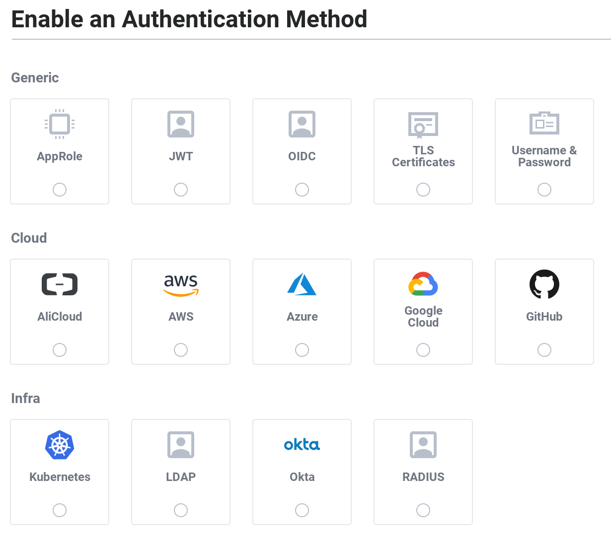

name: chapter-5
class: title, shelf, no-footer, fullbleed
background-image: url(https://hashicorp.github.io/field-workshops-assets/assets/bkgs/HashiCorp-Title-bkg.jpeg)
count: false

# Chapter 5      
## Vault Authentication Methods

???

* Chapter 5 introduces Vault authentication methods
* It focuses on the Userpass method.

---
layout: true

.footer[
- Copyright © 2021 HashiCorp
- 
]

---
name: vault-auth-methods
# Vault Authentication Methods
.center[]
.center[Vault supports many different authentication methods.]

???
* Auth methods are how your apps and users verify their identity.
* In the same way you might present some kind of valid ID at the hotel check-in desk, users and apps provide some kind of credential or token to authenticate.
* You can enable multiple auth methods and multiple instances of the same auth method.

---
name:vault-auth-methods-2
# Some Important Vault Auth Methods

<u>Methods for Users</u>
<ul>
<li>Userpass</li>
<li>GitHub</li>
<li>LDAP</li>
<li>JWT/OIDC</li>
<li>Okta</li>
</ul>

<u>Methods for Applications</u>
<ul>
<li>AppRole</li>
<li>AWS</li>
<li>Azure</li>
<li>Google Cloud</li>
<li>Kubernetes</li>
</ul>

???
* Userpass - Allows users to authenticate with username and password managed by Vault
* GitHub - Allows users to authenticate with their GitHub personal access tokens
* LDAP - Allows users to authenticate against an LDAP server with their username and password managed by that server.
* JWT/OIDC - Allows users to authenticate against an external OpenID Connect provider or with JSON Web Tokens (JWTs)
* Okta - Allows users to authenticate using Okta single sign-on.
* AppRole - Allows applications to authenticate in automated workflows using a role and a role ID.
* AWS - Allows applications on AWS EC2 instances and Lambda functions to authenticate with IAM credentials or EC2 metadata.
* Azure - Allows applications associated with Azure Managed Service Identities to authenticate using Azure Active Directory credentials.
* Google Cloud - Allows applications in GCP to authenticate using Google Cloud IAM service accounts or Google Compute Engine (GCE) metadata.
* Kubernetes - Allows Kubernetes pods to authenticate with JWT tokens.

---
name: enabling-auth-methods
# Enabling Authentication Methods

* Most Vault auth methods need to be explicitly enabled.
* This is done with the `vault auth enable` command.
* Each auth method has a default path.
* Alternate paths can be specified to enable multiple instances:  `vault auth enable -path=aws-east aws`
* Custom paths must be specified in CLI commands and API calls: 
`vault write aws-east/config/root` 
instead of 
`vault write aws/config/root`

???

* Talk about enabling auth methods.
* Talk about default and custom paths
* Explain the examples

---
name: userpass-0
# Vault's Userpass Auth Method
.center[]
* The Userpass method authenticates users with usernames and passwords managed by Vault.

???
* The Userpass method allows users to authenticate with username and password managed by Vault.
* It is not recommended for production, but it's fine for development and lab environments.
* In the real world you'd probably have Vault use your Active Directory, LDAP, GitHub, or other system of record for authentication by users.

---
name: chapter-5-review-questions
# 📝 Chapter 5 Review
* What types of entities can Vault authenticate?
* What system manages credentials for the Userpass auth method?
* Can a user that is not assigned any policies other than the default policy access any secrets?

???
* Let's review what we learned in this chapter.

---
name: chapter-5-review-answers
# 📝 Chapter 5 Review

* What types of entities can Vault authenticate?
  * Users and applications
* What system manages credentials for the Userpass auth method?
  * Vault
* Can a user that is not assigned any policies other than the default policy access any secrets?
  * No

???
* Here are the answers to the review questions.
