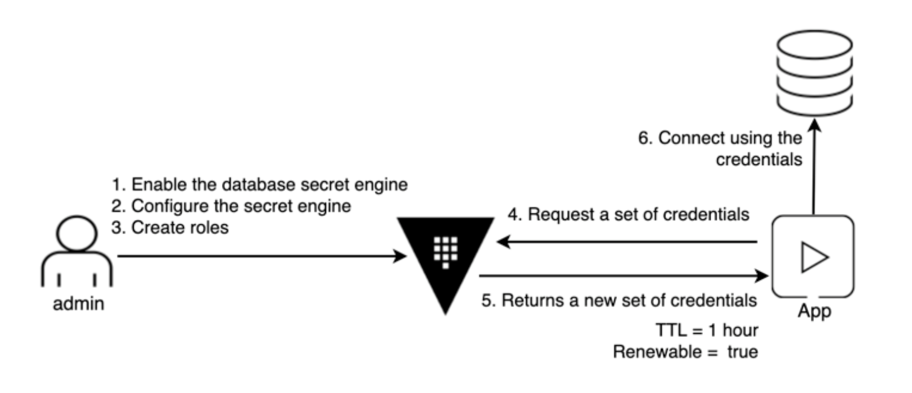

name: chapter-7
class: title, shelf, no-footer, fullbleed
background-image: url(https://hashicorp.github.io/field-workshops-assets/assets/bkgs/HashiCorp-Title-bkg.jpeg)
count: false

# Chapter 7    
## Dynamic Database Secrets


???

* Chapter 7 introduces Vault's Database secrets engine which can dynamically generate short-lived credentials for various databases. But, just before jumping into another Vault capability, let's step back and see who and for what perposes uses Vault.

---
layout: true

.footer[
- Copyright © 2021 HashiCorp
- 
]

---
name: vault-auth-methods

.center[]

???
* Starbucks builds secret and identity management capabilities for 100k+ retail edge devices with HashiCorp Vault. 
* In one of our latest overviews, Starbucks stated that short-lived, dynamic secrets are much easier to manage in a system like Vault. They simplify automation and remove a ton of operational overhead and risk.

---
name: dynamic-database-secrets
# Dynamic Secrets: Protecting Databases

.center[]

???
* Vault's Database secrets engine supports dynamic generation of short-lived credentials (usernames and passwords) for databases. So you do not need to keep track and manage long lived credentials
* By adopting this strategy, applications no longer need to hardcode a generic, long-lived service account to access the database. Each application or node can now generate on-demand credentials (username and password) when access is needed, and Vault revokes those credentials at the end of the TTL.


---
name: database-engine-plugins
# Database Secrets Engine: Plugins
* Cassandra
* Elasticsearch
* Influxdb
* HanaDB
* MongoDB
* MSSQL
* MySQL/MariaDB
* PostgreSQL
* Oracle

???
* The database secrets engine has out-of-the-box plugins for many databases.
* Custom plugins can also be built.

---
name: mysql-config-connection
class: compact
# Configuring Connections for MySQL
#### Run these commands to enable the Database secrets engine and configure a connection for use with MySQL:
```bash
vault secrets enable -path=lob_a/workshop/database database

vault write lob_a/workshop/database/config/wsmysqldatabase \
    plugin_name=mysql-database-plugin \
    connection_url="{{username}}:{{password}}@tcp(localhost:3306)/" \
    allowed_roles="workshop-app","workshop-app-long" \
    username="hashicorp" \
    password="Password123"

vault write -force lob_a/workshop/database/rotate-root/wsmysqldatabase
```
#### This creates a connection called "wsmysqldatabase" against the MySQL server on localhost.

???
* This slide shows the commands to enable the Database secrets engine and configure a connection for MySQL.
* We specified a number of things in the configuration:
    * The path someone would call: "lob_a/workshop/database"
    * The name of the database the role can interact with: wsmysqldatabase
    * The connection URL
    * The initial username and password
    * The roles that can be used with this connection
* We then rotated the password for the "root" user so that only Vault knows it.

---
class:compact
# Configuring Roles for MySQL
#### Run this command to configure a role for MySQL:
```sql
vault write lob_a/workshop/database/roles/workshop-app-long \
    db_name=wsmysqldatabase \
    creation_statements="CREATE USER '{{name}}'@'%' IDENTIFIED BY '{{password}}';
    GRANT ALL ON my_app.* TO '{{name}}'@'%';" \
    default_ttl="1h" \
    max_ttl="24h"
```
#### This defines a role against the "wsmysqldatabase" connection which generates credentials with an initial TTL of 1 hour. But their lifetime can be extended up to 24 hours.

???
* We specified a number of things:
    * The creation statements that define the capabilities of the userd that are created
    * The default time to live for generated users
    * The maximum duration for generated users

---
name: mysql-generate-creds
class:compact
# Generating Database Credentials
#### Run this command to generate actual credentials for the MySQL database against the role that was configured on the previous slide:
```bash
vault read lob_a/workshop/database/creds/workshop-app-long  
```
#### This should return something like:<br>
```bash
Key                Value
---                -----
lease_id           lob_a/workshop/database/creds/workshop-app-long/JeUGIL2xD6BzXSneqity8UmF
lease_duration     1h
lease_renewable    true
password           A1a-zy4ENaf2kwpzGk9t
username           v-token-workshop-a-DM0BJ3eMlMhbf
```

???
* Now, we can begin generating credentials for our MySQL database.

---
name: mysql-renew-revoke-creds
class:compact
# Renewing and Revoking Database Credentials
#### Run this command to renew credentials, replacing `<lease_id>` with the right lease_id:
```bash
vault write sys/leases/renew lease_id="<lease_id>" increment="120"  
```
#### Run this command to revoke credentials, replacing `<lease_id>` with the right lease_id:
```bash
vault write sys/leases/revoke lease_id="<lease_id>"
```
#### You can also determine the remaining lifetime of the credentials:
```bash
vault write sys/leases/lookup lease_id="<lease_id>"
```

???
* These are the commands to renew and revoke Vault leases.
* When you run the `renew` command, Vault extends the lifetime of the credentials.
* When you run the `revoke` command, Vault revokes the lease and removes the credentials from the database server.
* It is also possible to determine the remaining lifetime of credentials.

---
name: chapter-7-review-questions
# 📝 Chapter 7 Review
* What is the main advantage of using Vault's database secrets engine?
* What happens when credentials expire?
* Is the database engine limited to the plugins listed in this chapter?
* Can more than one role be used against a single connection?

???
* The credentials are short-lived and less likely to be compromised.
* Vault deletes them from the database server.
* No.  Custom plugins can be written.
* Yes. This allows different apps to get credentials with different TTLs.


---
name: chapter-7-review-answers
# 📝 Chapter 7 Review

* What is the main advantage of using Vault's database secrets engine?
  * The credentials are short-lived and less likely to be compromised.
* What happens when credentials expire?
  * Vault deletes them from the database server.
* Is the database engine limited to the plugins listed in this chapter?
  * No.  Custom plugins can be written.
* Can more than one role be used against a single connection?
  * Yes. This allows different apps to get credentials with different TTLs.

???
* Here are the answers to the review questions.
