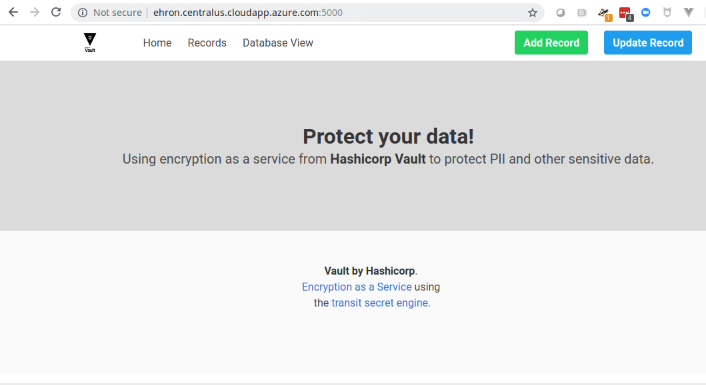
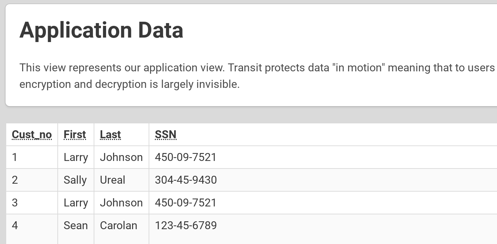

name: chapter-8
class: title, shelf, no-footer, fullbleed
background-image: url(https://hashicorp.github.io/field-workshops-assets/assets/bkgs/HashiCorp-Title-bkg.jpeg)
count: false

# Chapter 8    
## Encryption as a Service

???

* Chapter 8 introduces Vault's Transit secrets engine which functions as Vault's Encryption-as-a-Service (EaaS).

---
layout: true

.footer[
- Copyright © 2021 HashiCorp
- 
]

---
name: Vault-Transit-Engine

# Vault Transit Engine - Encryption as a Service
.center[]

* Vault's Transit Secrets Engine functions as an Encryption-as-a-Service.
* Developers use it to encrypt and decrypt data stored outside of Vault.

???
* Let's talk about Vault's Encryption-as-a-Service, the Transit secrets engine.
* It provides an encryption API & service that are secure, accessible and easy to implement.
* Instead of forcing developers to learn cryptography, we present them with a familiar API that can be used to encrypt and decrypt data that is stored outside of Vault.

---
name: transit-engine-benefits
# Transit Engine Benefits

* Vault's Transit Engine provides developers a well-architected EaaS API so that they don't have to become encryption or cryptography experts.
* It provides centralized key management.
* It ensures that only approved ciphers and algorithms are used.
* It supports automated key rotation and re-wrapping.
* If an attacker manages to get access to the encrypted data, they will only see ciphertext that is useless without Vault.

???
* There are seveal benefits of using the Transit engine.

---
name: Vault-Transit-Engine-1
# Vault Transit - Example Application

* In the next lab we'll use a web application that uses the Transit engine to encrypt and decrypt data.
* The app will store its encrypted data in the same MySQL database we used in Chapter 7.
* It will also get MySQL credentials from the Database secrets engine we configured in that chapter's lab.
* We'll first run the web app without Vault: No records are encrypted.
* We'll then run it with Vault enabled and see that new records are encrypted.

???
* Discuss the web app we will be using in this chapter's lab.
* Point out that it will use the same MySQL database from chapter 7.
* Point out that it will get its MySQL credentials from the Database secrets engine students set up in chapter 7.
* Indicate that we will first run without Vault and then with it.

---
name: web-app-screenshot
# The Web App
### Here is a screenshot of the Python web app:

.center[]

???
* Show the screenshot of the web app.

---
name: web-app-views
# The Web App's Views
###There are two main sections in the application.
1. **Records View**
  * The Records View displays records in plain text, showing what a logged in user would see after any encrypted data is decrypted.

1. **Database View**
  * The Database View displays the raw records in the database, showing what SQL commands would return:

---
name: records-view
# The Web App's Records View
.center[]

* As we would expect an authorized user is able to see some of the sensitive data because the app has decrypted any encrypted data.

???
* Show the records view of the web app.

---
name: Vault-Transit-Engine-6
# The Add User Screen
* In the lab, you will add new users to the database.
.center[]

???
* Describe the Add User screen that students will use to add new records to the database.
* Point out again that when Vault is enabled, the records will be encrypted in the database.

---
name: database-record-without-vault
# Record in Database View Without Vault Enabled
* After adding a record in the lab, you will be instructed to click on the  **Database View** menu.
* You should see the exact same data that you entered.
* This means that Personally Identifiable Data (PII) is being stored in plain text in our database records.
* How can we improve this? Let's enable Vault's Transit engine and see.

---
name: encrypted-record
# A Database Record Encrypted by Vault
#### Here is a record that was encrypted by Vault's Transit engine.
.center[]
* Note that the birth_date and social_security_number are encrypted.
???
* Show a record from the database encrypted by Vault's Transit engine.
* Point out that the birth_date and social_security_number field are encrypted as indicated by their starting with "vault:v1".
* Point out that the "v1" indicates that the first version of the encryption key was used.

---
name: encryption-key-rotation
# Rotating Transit Engine Encryption Keys
* The encryption keys of Vaults Transit Engine can be rotated.
* The newest version of the key is used to encrypt new data
* Older versions of the key can still decrypt old data but cannot decrypt new data.
* When we rotate the encryption keys, apps that use the Transit engine are unaware of any changes.
* Data can also be re-encrypted using the `rewrap` endpoint.

---
name: lab-transit-challenge-1
# 👩‍💻 Challenge 1: Enable the Transit Engine
* In this lab challenge, you'll enable the Transit engine.
* You'll do this in the [Vault Encryption as a Service](https://play.instruqt.com/hashicorp/invite/qleasfx1dszc) Instruqt track.
* Instructions:
  * Click the "Enable the Transit Secrets Engine" challenge of the "Vault Encryption as a Service" track.
  * Then click the green "Start" button.
  * Follow the challenge's instructions.
  * Click the green "Check" button when finished.

???
* Instruct the students to do the "Enable the Transit Secrets Engine" challenge of the "Vault Encryption as a Service" track.
* This challenge has them enable the Transit secrets engine on the path "lob_a/workshop/transit".

---
name: lab-database-challenge-2
# 👩‍💻 Challenge 2: Create an Encryption Key
* In this lab, you'll create an encryption key for use with the Transit engine you enabled in the previous challenge.
* Instructions:
  * If the track does not do it for you, click the "Create a Key for the Transit Secrets Engine" challenge of the "Vault Encryption as a Service" track.
  * Then click the green "Start" button.
  * Follow the challenge's instructions.
  * Click the green "Check" button when finished.

???
* Instruct the students to do the "Create a Key for the Transit Secrets Engine" challenge of the "Vault Encryption as a Service" track.
* This challenge has them create an encryption key for use with the Transit engine they enabled in the previous challenge.

---
name: lab-database-challenge-3
# 👩‍💻 Challenge 3: Use the Web App Without Vault
* In this lab, you'll use the web application without Vault.
* Instructions:
  * If the track does not do it for you, click the "Use the Web App Without Vault" challenge of the "Vault Encryption as a Service" track.
  * Then click the green "Start" button.
  * Follow the challenge's instructions.
  * Click the green "Check" button when finished.

???
* Instruct the students to do the "Use the Web App Without Vault" challenge of the "Vault Encryption as a Service" track.
* This challenge has them use the web application without Vault.
* Point out that the new record they add during this challenge will nto be encrypted.

---
name: lab-database-challenge-4
# 👩‍💻 Challenge 4: Use the Web App With Vault
* In this lab, you'll use the web application with Vault.
* You'll also rotate the encryption key.
* Instructions:
  * If the track does not do it for you, click the "Use the Web App With Vault" challenge of the "Vault Encryption as a Service" track.
  * Then click the green "Start" button.
  * Follow the challenge's instructions.
  * Click the green "Check" button when finished.

???
* Instruct the students to do the "Use the Web App With Vault" challenge of the "Vault Encryption as a Service" track.
* This challenge has them use the web application with Vault.
* Point out that the new record they add will have sensitive fields encrypted by Vault's Transit engine.

---
name: chapter-8-review-questions
# 📝 Chapter 8 Review
* What is the main advantage of using Vault's Transit secrets engine?
* Where does Vault's Transit Engine store encrypted data?
* Was the application still able to decrypt older encrypted records after you rotated the encryption key?
* Is it possible to tell which version of an encryption key was used?

???
* Let's review what we learned in this chapter.

---
name: chapter-8-review-answers
# 📝 Chapter 8 Review
* What is the main advantage of using Vault's Transit secrets engine?
  * Developers can encrypt data without being experts in cryptography.
* Where does Vault's Transit Engine store encrypted data?
  * Wherever developers want, but outside of Vault
* Was the application still able to decrypt older encrypted records after you rotated the encryption key?
  * Yes
* Is it possible to tell which version of an encryption key was used?
  * Yes. The version is indicated by `v1`, `v2`, etc.

???
* Here are the answers to the review questions.

---
name: conclusion
# Thank You for Participating!
.center[]

### For more information please refer to the following links:
* https://www.vaultproject.io/docs/
* https://www.vaultproject.io/api/
* https://learn.hashicorp.com/vault

???
* Thank the students for their participation
* Share some Vault links

---
name: Feedback-Survey
# Workshop Feedback Survey
* Your feedback is important to us!
* The survey is short, we promise:
  * http://bit.ly/hashiworkshopfeedback

???
* Ask them to fill out the online survey
